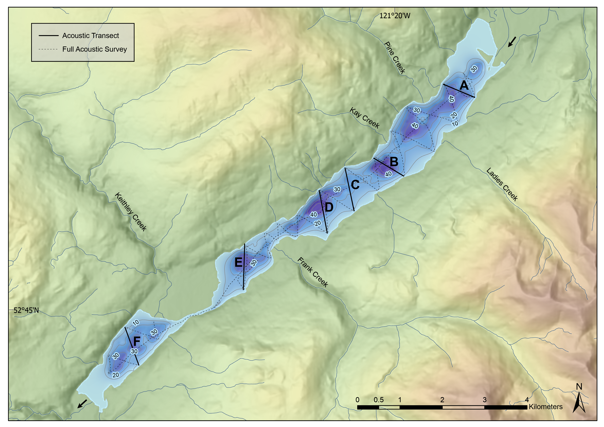

## Sub-bottom Acoustics

Acoustic stratigraphy from six selected transects conducted across Cariboo Lake reveal the range of morphologies and character of sedimentary deposits in Cariboo Lake (Fig. \@ref(fig:mapAcoustics)). Acoustic penetration is limited in coarser sediments from transects proximal to river fan-deltas across Cariboo Lake (see Fig. \@ref(fig:mapAcoustics) for fan-delta locations). Penetration, resolution and distinctive acoustic layering improves significantly along the thalweg of the lake bottom and in cross-lake transects more distal from the fan-deltas. Cross-hatching is observed over most of the acoustic record due to errant electrical interference from the research vessel. However, the interference does not affect the overall quality of the results in the six selected transects.

```{r mapAcoustics, echo=FALSE, fig.cap = "Map showing the Cariboo Lake bathymetry and Sub-bottom Acoustic Transects."}

```

Transect A, one kilometre southwest of the headwater Cariboo River delta, has a strong acoustic reflector at the sediment-water interface indicating the presence of coarser-grained material on the lakebed (Fig. \@ref(fig:acoustics), A). Grab samples on this transect show a high fraction of sandy materials which act as an acoustic mask limiting the penetration of the acoustic signal to a depth of 1-2 m. An acoustic multiple (echo) is observed 45 m below the sediment surface caused by the limited penetration at the surface (Fig. \@ref(fig:acoustics), A - i). Acoustically penetrable, well-layered sediment is observed 3.5 km from the Cariboo River delta in transect B (Fig. \@ref(fig:acoustics), B). Acoustic reflectors with 1-2 m spacing lies conformably over a hummocky basement, with a maximum observable sediment thickness of 15-20 m observed near the thalweg. Well structured layering extends across the south side of the transect but pinches out towards the north shore (Fig. \@ref(fig:acoustics)). Fig. \@ref(fig:acoustics) shows two channel-like depressions in this transect. 

```{r acoustics, echo=FALSE, fig.cap = "Panel of six selected sub-bottom acoustic transects A, B, C, D, E, and F. All transects are looking up-lake, see Fig. 2 for location. Transect A and B: Acoustic echo (multiple) is denoted by (i). Transect C: (i) denotes inferred bedrock or late-glacial material. (ii) and (iii) are v-notch scour channels. (A) and (B) are sediment facies. Transect D: Scour channels are denoted by (i) and (ii). Slumping is observed at (iii)."}
knitr::include_graphics("figs/acoustics/acoustics_6_panel.png")
```

Acoustic penetration increases in locations about 4.5 km from the Cariboo River delta at transect C (Fig. \@ref(fig:acoustics), C). The acoustic record along this transect reaches a maximum sediment thickness of 35 m in two troughs - the maximum thickness of surficial sediments observed across Cariboo Lake in this study. The acoustic basement is considered to be either bedrock or coarse-grained glacial sediment from the Last Glacial Maximum (Fig. \@ref(fig:acoustics), C – i). Two sediment facies are observed across this transect based on geometry and the strength and continuity of reflectors. Some disruption of these facies is caused by slumping of side slopes (e.g. north end of transect C). The lower unit, facies A, has a thickness of ~ 12 m along undisturbed sections (Fig. \@ref(fig:acoustics), C - A) and is more massive to weakly acoustically layered. The contact with overlying sediment above facies A appears to be conformable at the south end and middle of the transect but unconformable in other places.  The unconformities are most apparent in the two sharp crested v-notch channels at the middle of the transect. These channels are a continuation of those noted in transect B. These are inferred to be scour channels formed by erosive, higher energy, turbidity currents that probably date to deglaciation of the lake basin.  The lack of numerous layers and generally lighter grey tone in facies A indicates a somewhat higher energy and more rapid deposition of coarser lacustrine sediment.  

Facies B begins with high-amplitude parallel reflectors with 2-3 m spacing and conforms well with facies A below, outside of areas of disturbance. (Fig. \@ref(fig:acoustics), C - B). Facies B has a thickness of ~ 10 m along undisturbed sections and deepens to a maximum of 13 m within the scour channels (Fig. \@ref(fig:acoustics), C - ii & iii). The strength of reflectors in facies B are stronger and more numerous than those in facies A indicating more frequent events of lower overall magnitude during this time period. The strength of reflectors gradually decreases moving upwards and spacing thins to sub metre near the surface. The gradual decrease in reflectance is interrupted by a strong reflector at the top of facies B along the sediment-water interface. 

The two buried troughs in transect C (Fig. \@ref(fig:acoustics), C - ii, iii) are significant and best expressed  in this area of the lake. The north trough (ii) appears to be a depression that was continuously infilled by facies A and then B. Hence it most likely represents an older pre-existing feature. The sediments in the southern trough (iii) are interesting in that a wedge of sediment infill seems to be an unconformable deposit with both facies B below and facies A above. It is likely that an erosional channel developed after or in the later stages of facies A deposition which infilled the wedge. Sedimentation of the wedge was then truncated by the onset of the facies B sediment. While the two troughs might have been active at the same time during deglaciation, only the southern trough was reactivated at a later time and infilled with sediment prior to the onset of facies B deposition.

Transect D, to the northeast of the Frank Creek delta has well-layered sediments in the top 5-10 m and transitions to poor acoustic penetration below this (Fig. \@ref(fig:acoustics), D). The parallel reflectors observed in the uppermost sediment layers of transect D have a thickness of 2-3 m and have a higher amplitude compared to facies B in transect C. Some slumping of sidewall sediments is observed on the south sidewall (Fig 6, i).

Southwest of the Frank Creek fan-delta, acoustic reflectors along transect E show a decline in reflectance and a decrease in layer thickness to < 1 m. Acoustic masking from course grained sediment occurs at depths of 2-4 m along the south margin (Fig. \@ref(fig:acoustics), E). Total sediment thickness of finer, acoustically well-layered material along the north bench is significant approaching 10 m.  The sedimentary environment southwest of the Frank Creek delta is comparably different to transects northeast of the delta. The profile suggests that much of the suspended sediment transported from the upper lake does not make it past the shallow lake depths (< 20 m) of the sill at the Frank Creek fan-delta apart from the northern most part of the transect. So, coarser sediment from the Frank Creek fan-delta dominates the south side of the transect and fine sediment deposition is restricted, or forced, to the north side. The Coriolis effect may enhance this as suspended sediments are deflected to the right as they enter Cariboo Lake from Frank Creek. 

Similar to the Frank Creek fan-delta, the very shallow sill of less than 2 m opposite the Keithley Creek prograding fan-delta significantly reduces sediment connectivity to the main Cariboo Lake basin. (Fig. 1). Transect F, located close to the centre of the Keithley Creek sub-basin shows a maximum observable sediment thickness of 4 m concentrated in the basin thalweg (Fig. 8). Below this there is acoustic masking by coarser grained sediment. The acoustic reflectors within the top 4 m of transect F are acoustically penetrable, well layered and are conformable to the basin morphology. These reflectors are of higher amplitude compared to those in transect E and are thicker at 1-2 m. This suggests that significant amounts of coarse-grained sediments are found in this part of the lake, likely originating from the high energy Keithley Creek drainage basin. Fine faction sediments from the main Cariboo Lake are expected to make up a small percentage as transport into this sub-basin is limited by up-lake storage and filtering. 