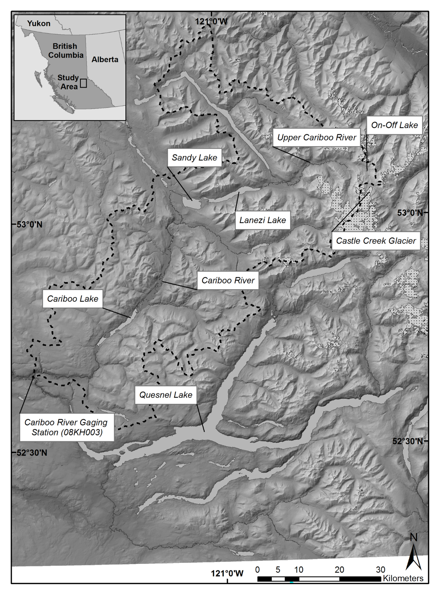

```{r setup, include=FALSE}
library(dplyr)
knitr::opts_chunk$set(echo = F, warning = F, message = F)
knitr::opts_chunk$set(out.width = "100%", fig.align = 'center')
```

# Introduction

Environmental proxies that extend back beyond the modern observable record are crucial to understanding earth system processes [@Turney2019; @Huber2012; @Nelson2016]. Proxy reconstructions at the sub-annual (e.g. ice cores, tree rings, and corals), to multi-decadal (e.g. sediments, pollen, boreholes) have proven useful in describing past environmental conditions across the globe [@Masson2013]. Sedimentary sequences collected from glaciated watersheds have been important in contributing to regional understanding of climate and hydrologic variability over the late Holocene. Research by @Neukom2019 have utilized sedimentary sequences as part of larger paleolimnological collections to provide a reconstruction of temperature variability over the last 2000 years. Despite their importance, relatively few records have been collected across the globe. In western Canada, recovered sedimentary sequences have primarily been collected in the Coastal Mountains [@Menounos2008], St. Elias Mountains [@Crookshanks2008], and Rocky Mountains [@Desloges1999a]. To fill this geographic gap a recent study has looked at Quesnel Lake, British Columbia proximal to the Cariboo Mountains. Additional records from this region could provide additional evidence for this unique geographic region. This study presents a new record of hydroclimatic variability over the past 10 k years by sub-bottom acousitc (coarse resolution), and 2 k years through sediment cores (~50-100 yr variability). 

The purpose of this research is to 1) Establish an understanding of the mechanisms that control the production, connection, and transport of sediment in the Cariboo Lake basin. 2) Determine whether sediment archives collected from Cariboo Lake contain a record of late Holocene glacier and sediment activity. 3) Compare the Cariboo Lake sediment record to other regional climate proxies. Previous studies have had success relating sediment archives to changes in local temperature, precipitation patterns, and glacier extent. However, these studies have primarily been located within the Coast Mountains and Rocky Mountains of Canada. This study presents a proxy of previous geomorphic and hydromorphic change for an understudied region of western Canada.

# Study Area

Cariboo Lake is located in the northern foothills of the Columbia Mountains, 85 km northeast of Williams Lake, British Columbia Fig. \@ref(fig:map-basin). The lake receives runoff from an area of 3242 km^2^, and the watershed relief ranges from 2600 m asl in the headwaters to 600 m asl at the Cariboo Lake outlet. The Cariboo Lake watershed has 80 km ^2^ (as of 2017) of permanent ice cover which covers 2.4% of the total watershed. The most extensive glaciated terrain is proximal to Mt. Lunn roughly 60 km upstream of Cariboo Lake.

The Cariboo River, located on the east end of the lake provides the main source of sediment into the lake. The bathymetry of Cariboo Lake shows evidence of past glacial scouring, indicated by deep scour channels Fig. \@ref(fig:map-lake). The lake is separated into two main basins, by the Keithley Creek fan delta. The upstream basin is called the main Cariboo Lake basin, and the downstream basin is called the Keithley Creek basin. The bathymetry of the lake reaches a maximum depth of over 50 m in two scour channels within the central part of the main Cariboo Lake basin. 


```{r map-basin, echo=FALSE, fig.cap = "Map showing the Cariboo Lake basin."}

```

```{r map-lake, echo=FALSE, fig.cap = "Map showing the Cariboo Lake bathymetry and coring locations."}
knitr::include_graphics("figs/map.png")
```

Sediment connectivity to headwater glaciers along the Cariboo River is limited due to lake filtering by Lanezi and Sandy lake. Lanezi Lake is a deep fjord lake with a bathymetry reaching a maximum depth of 170 m. Sandy Lake is much shallower reaching a maximum depth of 6 m. The Matthews River, which meets the Cariboo River just below Lanezi Lake provides less filtered connection to meltwater from several alpine glaciers including the largest chunk of ice in the Cariboo Lake watershed, the Roberts Peak Galcier.

# Methods

*Field Methods*

A field campaign was conducted during the summer of 2017 to collect sub-bottom acoustic soundings, dredge samples, and sediment cores. Thirty-four km of sub-bottom acoustic soundings were collected across Cariboo Lake using a 10 kHz StrataBox 3510 HD. An Ekman dredge was used to collect 20 ~10 cm^3^ samples of sediment from the lake bottom. The dredge samples were subsampled in the field using an 80 mm diameter PVC cylinder pushed into the block of sediment. The remaining sediment was kept as a bulk sediment sample. Four sediment cores (V1-V4) were collected using a Rossfelder submersible vibracorer with a 6 m long 70 mm diameter aluminum pipe. The Ekman subsample cores and the vibracores were split longitudinally with one half preserved as an archive and the other as a workging half. The working half samples were prepared for imaging by scraping the core parallel to the sediment laminae to create a flat surface which showed the sediment stratigraphy. The stratigraphy of cores V1 and V2 were best preserved and were selected for detailed analysis. 

*Laboratory Methods*

Cores V1 and V2 were subsampled with 2 cm^3^ of sediment extracted at a 5 cm interval, with additional samples taken within stratigraphic breaks. The Ekman bulk samples and vibracores were analyzed for laminae thickness, organic content, and particle size. Laminae couplets were digitally counted and measured for thickness using the ImageJ @imageJcite software. Organic content was determined by loss-on-ignition analysis (550 °C) following methods in @Smith2003. Samples were first weighed to provide an initial wet weight, then dried at 60 °C and weighed again after oven drying. The samples were then placed in a furnace at 550 °C for 2.5 hours and weighed a third time. Grain size analysis was conducted using a Mastersizer Particle Size Analyzer 3000. Samples were prepared following methods by @Gray2010 to remove the fine fraction of particles from organic material. This involved a removal of organic material using three sequential alloquots of 20% H202 until the sample stopped reacting. To prevent flocculation of sediment grains the samples were dispersed in 0.05% solution of Calgon for 24 hours. The chronology of both cores was provided by AMS ^14^C dating of wood fragments at the André E. Lalonde AMS Laboratory at the University of Ottawa and varve chronology from laninae counting.

# Results

```{r child = 'acoustic_results.Rmd'}
```

```{r child = 'spatial_results.Rmd'}
```

```{r child = 'temporal_results.Rmd'}
```

# Discussion

Evidence of late Pleistocene deglaciation in the Cariboo Lake region is provided by coarse resolution sub-bottom acoustic records. More detailed late Holocene watershed activity is provided by more analysis at the centennial time-scale from sediment cores which span 2 ka BP. Previous evidence of lase Pleistocene deglaciation of the Cordilleran Ice Sheet has been provided by @Hodder2006 for Mud Lake to the west of the Rocky Mountain trench, who found the early phase of deglaciation starting prior to 9.6 ka BP. Research by @Menousnos2009 has pointed to the deglaciation of most of the Cordilleran ice sheet before 10.5 ka BP. Some evidence for late Pleistocene deglaciation is provided in the Cariboo Lake sediments. While the sediment accumulation rates are limited to the past 2 ka, we speculate on the transition of sediment facies observed in the longer acoustic records which extend into the late Pleistocene by assuming similar sediment accumulation rates during this time. While Holocene sediment accumulation rates in western Canada are known to be variable over the Holocene period, @Menounos2009 notes that early to mid Holocene rates were lower than late Holocene so there is perhaps a slight over estimation in sediment rate by extending back. 

Sub-bottom acoustic records from Transect B shown in Figure \@ref(fig:acoustics), proximal to V1, indicate a transition from massive to well layered sediments occurring around 10.5 ka BP. This is based on a thickness of 20 m for the well layered facies and average C14 sediment accumulation rate of 1.9 mm/yr from core V1. Transect C, located in-between cores V1 and V2, has ~ 15 m of well layered sediment overlying a massively layered lower facies. This transition is estimated to have occurred around 9 ka BP based on an average sediment accumulation rate of 1.7 mm/yr for V1 and V2. The timing of this transition is similar to the onset of deglaciation and start of the Holocene sediment package within Mud Lake, BC in @Hodder2006 of 9.6 ka BP, Moose Lake, BC in @Desloges1999 around 10.3 ka BP, and the Upper Bow River, AB in @Leonard1999 11.7 ka BP. The sediment massively layered sediment package of Cariboo Lake that predates 10.5 - 9 ka BP is therefore likely a result high sediment delivery when ice was more proximal to the lake during the cool and wet climate. Following this, the transition to a more seasonally variable sediment flux, is expected as glaciers were depleted and retreated up the valley to Alpine Cirques by a warmer and drier climate around this time. It is expected sediment would have been primarily delivered during the late-spring freshet likely during the transition to a warmer climate where glaciers began declining in extent. 

Although coarser grained sediments from discrete turbidite flows are found proximal to sidewall tributary deltas, silt and clay comprise over 90% of the sediment at V1 and V2 and is inferred to have been delivered via suspension from the main Cariboo River. Therefore, the sediment stratigraphy from cores V1 and V2 provide a high-resolution physical proxy for late Holocene hydroclimatic regimes in the watershed. The Cariboo River has two main tributaries, the Upper Cariboo River and the Matthew River which are connected to high alpine peaks and glaciers which provide a significant source of sediment. Sediment connectivity between these upper tributaries is limited however by several deep fjord like lakes including Lanezi and Sandy Lake along the Upper Cariboo River, and Ghost Lake along the Matthew River which act as sediment traps limiting the transfer of sediment from the production zones and results in the low sedimentation rates observed in cores V1 and V2. Although connectivity is limited, enough suspended sediment to produce annual varves reaches Cariboo Lake.

Across the Canadian Cordillera glacial lakes have a range of Holocene accumulation rates from relatively low at millimeters per year (e.g. Quesnel Lake with 0.7 mm/yr; @Gilbert2012), to centimeters per year (e.g., Lillooet Lake, 2-7 cm/a; @Gilbert2009), to a maximum of 0.5 m/a observers in Kluane Lake (@Gilbert2009). The relative range in accumulation rates has been understood to be a result in the variability of sediment production from glacier processes and steep topography [@Ballantyne2002], and the basin connectivity to deliver the sediment downvalley @cite. The average accumulation rate for Cariboo Lake of 1.7 mm/yr over the last two millenia, based off on an average of two radiocarbon dates, fits on the lower end of the range of accumulation rates previously identified across the Canadian Cordillera. While Quesnel Lake is adjacent to the Cariboo Lake Basin and located in a similar topographic setting the relatively low glacier coverage of 0.8% for the basin combined with the extremely deep lake depth which likely limits sediment deliver to the lake bed, and the large surface area contributes to the lower sediment accumulation rate observed compared in Quesnel to the rates observed in Carboo Lake. Moose Lake, which is fed by the steep valley glaciers of Mount Robson and has basin glacier coverage of 3.2%, has a average sediment accumulation of 2.7 mm/yr. 

Previous authors on sediment varve studies have noted the sediment signal from climatic transitions typically occur over hundreds of years due to the slow reponse of sediment availability, conveyance, and deposition. Boundary conditions may also exist which can limit the sensitivity of sediment yield to climate change [@Desloges1999]

Higher organic content corresponds with higher rates of sediment accumulation from 0-700 CE. 

Comparison to regional climate anomalies 

- Thicker and coarser varves from 0-700 CE during colder wetter climate, why is there more LOI during this time.
- Smaller less coarse varves from 700-1500 CE during warmer dryer climate, LOI stays high.
- Coarser, thick varves during cold wet climate over the LIA, and LOI decreases
- Post- LIA LOI shows dramatic decline in organic content. Maybe lead lag effect? Boundry Conditions?


# Conclusion

- Acoustic records provide coarse resolution of sedimentation into Cariboo Lake. Facies A and B from transect C, totaling 25 m thick provide evidence of sediment accumulation rates from 15 ka BP to present (based on 1.7 mm/yr avg accumulation rate from V1 and V2 AMS dates). Higher rates of sediment delivery to Cariboo Lake is evident over Facies A, from 15 - 9 ka BP. More frequent, but lower in magnitude reflectors are observed over Facies B, from 9 ka BP to present. 
- Rhythmically laminated silt and clay sediment are found in deep sub-basins (30-50 m deep) distal from river deltas.
- Above average sediment accumulation to Cariboo Lake is observed from 0 to 700 CE, above average from 700-1500 CE based on grain size and varve thickness, and average to above average from 1500 CE to present.
- Past major climate anomolies do not correlate well across all sediment characteristics 