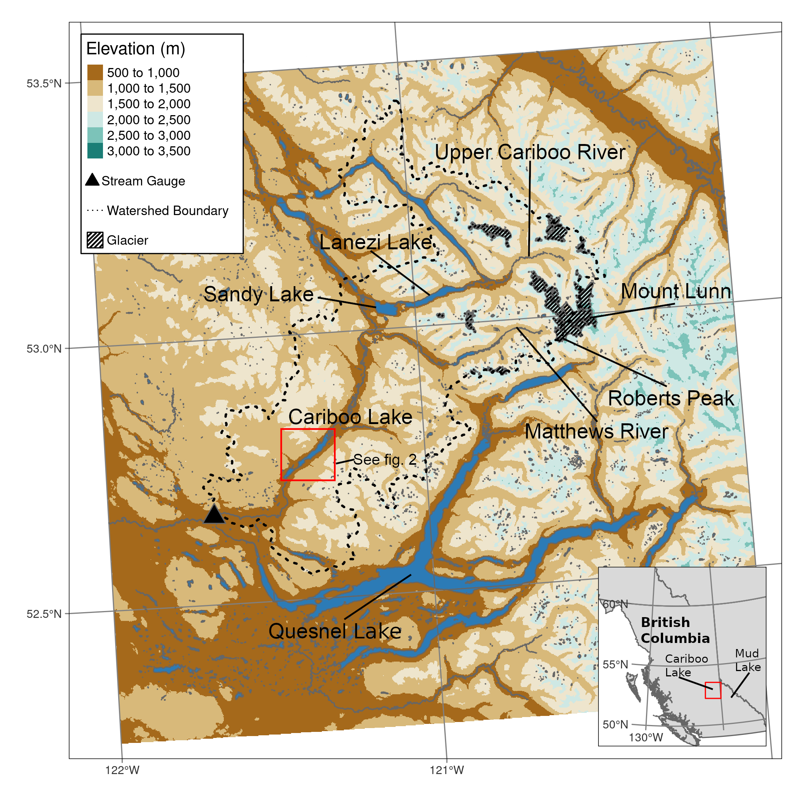

```{r setup, include=FALSE}
library(dplyr)
library(flextable)
knitr::opts_chunk$set(echo = F, warning = F, message = F)
knitr::opts_chunk$set(out.width = "100%", fig.align = 'center')
set_flextable_defaults(font.size = 8)
```

\let\oldrule=\rule
\renewcommand{\rule}[1]{\oldrule{\linewidth}}

---

Alexander Cebulski^1^, Joseph Desloges^2^ (ORCID ID - 0000-0001-8446-3034)

^1^Department of Geography, University of Saskatchewan, Canada

^1^Department of Geography and Department of Earth Sciences, University of Toronto, Canada

**Abstract:** Cariboo Lake is situated in a mountains region of British Columbia Canada and is representative of environments transitioning from arid interior climates to glaciated high mountain regions to the east. Sub-bottom acoustic transects and short and long core sediment are analyzed to present a record of sediment accumulation over the Holocene. Acoustically penetrable sediment is observed in deep parts of the lake reach a maximum thickness of 35 m representing deglacial and Holocene accumulation. A transition from massive to well-layered sediments is observed in the sub-bottom acoustic record during final phases of valley deglaciation in the region (ca. 10.5-9 ka BP). Fine clastic sediments produced from the glaciated headwaters are delivered by Cariboo River as overcurrents into the lake which produce bimodal rhythmic layering of silt and clay sediments. Laminae couplets are inferred to be deposited annually according to two AMS radiocarbon dates and a varve counting chronology. Two long cores, 2.9 and 3.8 m in length, were selected for analysis with estimated basal dates of ~2 ka BP. The accumulation of sediment into Cariboo Lake shows above average sediment accumulation rates between 0-700CE and 1500-2017CE which are coincident with cool temperatures and peak glacier extents. The sediment chronology presented in this study contributes to the existing body of knowledge of lake sediment accumulation and Holocene watershed activity in this transitional climate region of western Canada. 

**Keywords:** Lake, Sediment, Holocene, Acoustic records, Varve, Climate proxy, British Columbia

---

\pagebreak
\tableofcontents
\pagebreak

# Introduction

Environmental proxies that extend back beyond the modern observable record are crucial to understanding earth system processes [@Turney2019; @Huber2012; @Nelson2016]. Proxy reconstructions at the sub-annual scale (e.g. ice cores, tree rings, and corals), to multi-decadal scales (e.g. sediments, pollen, boreholes) have proven useful in describing past environmental conditions across the globe [@Masson2013]. Sedimentary sequences collected from climate sensitive glaciated watersheds have been important in contributing to regional understanding of climate and hydrologic variability over the Holocene. Research by @Neukom2019 have utilized sedimentary sequences as part of larger paleolimnological collections to provide a reconstruction of temperature variability over the last 2000 years. In the western Cordillera of Canada, recovered sedimentary sequences have been collected in the Coast Mountains [@Menounos2008], St.Elias Mountains [@Crookshanks2008], Monashee Mountains [@Hodder2006], and Rocky Mountains [@Leonard1986; @Dirszowsky1997a; @Desloges1999]. A study of nearby Quesnel Lake (272 km^2^) by @Gilbert2012 found deglacial, and the very earliest Holocene, sediment infills to be high at around 10.4 ka BP and declining significantly at around 8.4 ka BP. Trends in Quesnel Lake sediment characteristics during the Holocene were not detectable as accumulation rates were very low in the areas of the lake that could be sampled. Quesnel Lake is very large relative to the contribution watershed size and therefore the sediment system is much less sensitive to climate variability. Previous studies on lakes in smaller watersheds with significant glacier cover have had greater success relating lake bottom sediment archives (e.g. varves) to changes in regional temperature, precipitation patterns, and glacier extent over the Holocene [@Desloges1999; @Hodder2006; @Menounos2009b]. However, when sediment inputs and are high due to extensive glacier melt, this can limit the ability to sample the very thick accumulations. To fill in the gap between high resolution and long temporal coverage (entire Holocene thick sequences), the study here uses Cariboo Lake (11 km2) draining 3244 km^2 in the Cariboo Mountains of eastern-central British Columbia.  

This study aims to present a new record of Holocene hydroclimatic variability using lake bottom sediment records recovered using sub-bottom acoustic methods and long sediments cores. To determine if the Cariboo Lake contains a record of regional temperature and precipitation variability, the relative role of sediment input from the upstream Cariboo River, controlled by watershed wide trends in temperature and precipitation, compared to smaller unglaciated watersheds that border the lake is assessed. 

The purpose of this research is to 1) establish an understanding of the mechanisms that control the delivery and deposition of the fine sediment fraction to Cariboo Lake, 2) to reconstruct the highest resolution and longest term sediment accumulation record possible for this area of BC, 3) compare and contrast the accumulation record in this transitional (semi-arid to glaciated mountainous) lake system with regional climate proxies.

# Study Area

Cariboo Lake is located in the northern foothills of the Columbia Mountains, 85 km northeast of Williams Lake, British Columbia (Figure \@ref(fig:map-basin)). The lake receives runoff from an area of 3244 km^2^, and the watershed relief ranges from 2600 m asl in the eastern headwaters to 600 m asl at the western Cariboo Lake outlet. The west to east, 90 km long watershed spans climate ranging from 1370 mm/yr in the headwaters to 477 mm/yr at the semi-arid outlet to the lake. The area of Cariboo Lake is 10 km^2^ resulting in a lake-to-watershed area ratio of 0.3%. The Cariboo Lake watershed has 64 km^2^ of permanent ice cover which covers 2% of the total watershed [@Bolch2008]. The most extensive glaciated terrain is proximal to Mt. Lunn roughly 60 km upstream of Cariboo Lake.

The Cariboo River, draining into the east margin of the lake, is the main source of sediment. The lake is separated into two basins, by a large alluvial ban building cross-valley from Kiethley Creek (Figure \@ref(fig:map-lake)). The upstream basin is 8 km^2^ and is referred to here as the main Cariboo Lake basin. The downstream basin is 2 km^2^ and, is called the Kiethley Creek basin. The bathymetry of the lake reaches a maximum depth of over 50 m in two deep holes within the central part of the main Cariboo Lake basin. These deep holes provide some evidence of past glacial scouring.


```{r map-basin, echo=FALSE,out.width = "100%", out.height="100%", fig.cap = "Map of the Cariboo Lake basin. Inset map shows the location of the Cariboo Lake basin within British Columbia and relative to the Mud Lake basin from the Hodder et. al, (2007) study."}

```

```{r map-lake, echo=FALSE, fig.cap = "Map of the Cariboo Lake bathymetry and coring locations. Bathymetric interval is 10 m. Acoustic transects selected for analysis are shown with a black solid line and labeled A, B, C, D, E and F. Fan deltas mentioned in the text are represented by black triangles and are referenced to by the upstream creek (i.e. Frank Creek Delta is the triangle below Frank Creek)."}
knitr::include_graphics("figs/maps/cl_bathymetry_acoustics_coring_locations_labels.png")
```

Sediment connectivity to headwater glaciers along the Cariboo River is limited due to lake filtering by Lanezi and Sandy lake (Figure 1). Lanezi Lake is a deep fjord-like lake with a bathymetry reaching a maximum depth of 170 m. Sandy Lake is much shallower reaching a maximum depth of 6 m. The Matthews River, which meets the Cariboo River just below Lanezi Lake provides a less filtered connection to meltwater sources draining several alpine glaciers including the largest area of ice (10 km^2^) in the Cariboo Lake watershed, proximal to Roberts Peak (Figure 1).

# Methods

*Field Methods*

A field campaign was conducted during the summer of 2017 to collect sub-bottom acoustic soundings, dredge samples, and sediment cores. Thirty-four km of sub-bottom acoustic soundings were collected across Cariboo Lake using a 10 kHz StrataBox 3510 HD. An Ekman dredge was used to collect 20 ~10 cm^3^ samples of sediment from the lake bottom. The dredge samples were subsampled in the field using an 80 mm diameter PVC cylinder pushed into the block of sediment. The remaining sediment was kept as a bulk sediment sample. Four sediment cores (V1-V4) were collected using a Rossfelder submersible vibracorer with a 6 m long 70 mm diameter aluminum pipe. The Ekman subsample cores and the vibracores were split longitudinally with one half preserved as an archive and the other as a working half. The working half samples were prepared for imaging by scraping the core parallel to the sediment laminae to create a flat surface which showed the sediment stratigraphy. The stratigraphy of cores V1 and V2 were best preserved and were selected for detailed analysis. 

*Laboratory Methods*

Cores V1 and V2 were subsampled with 2 cm^3^ of sediment extracted at a 5 cm interval, with additional samples taken within stratigraphic breaks. The Ekman bulk samples and vibracores were analyzed for laminae thickness, organic content, and particle size. Laminae couplets were digitally counted and measured for thickness using the ImageJ software, by @imageJcite. Organic content was determined by loss-on-ignition analysis (550 °C) following methods in @Smith2003. Samples were first weighed to provide an initial wet weight, then dried at 60 °C and weighed again after oven drying. The samples were then placed in a furnace at 550 °C for 2.5 hours and weighed a third time. Grain size analysis was conducted using a Mastersizer Particle Size Analyzer 3000. Samples were prepared following methods by @Gray2010 to remove the fine fraction of particles from organic material. This involved a removal of organic material using three sequential alloquots of 20% H~2~0~2~ until the sample stopped reacting. To prevent flocculation of sediment grains the samples were dispersed in 0.05% solution of Calgon for 24 hours. Grain size was measured three times for each sample, resulting in an average instrument error of +/- 0.01 µm. The chronology of both cores was provided by AMS ^14^C dating of wood fragments at the André E. Lalonde AMS Laboratory at the University of Ottawa and varve chronology from laminae counting on images.

# Results

```{r child = 'acoustic_results.Rmd'}
```

```{r child = 'spatial_results.Rmd'}
```

```{r child = 'temporal_results.Rmd'}
```

# Discussion

Evidence of late Pleistocene deglaciation in the Cariboo Lake region is provided by coarse temporal resolution sub-bottom acoustic results whereas greater detail in late Holocene watershed activity comes from sediment cores which span the last 2 ka BP. A study of the nearby and similar sized watershed of Mud Lake (Figure 1 – inset) is evaluated by by @Hodder2006, who found the early phases of deglaciation and lake sediment infill started just prior to 9.6 ka BP. Gilbert and Desloges (2012) indicate deglaciation of the north and west arms of the much larger Quesnel Lake was likely complete by 8.6 ka BP. @Menounos2009b pointed to the deglaciation of most of the Cordilleran ice sheet before 10.5 ka BP. The Cariboo Lake acoustic results contribute to this regional record however, limited available dates present some uncertainty in the record presented here. Higher resolution AMS dated sediments from the west arm of Quesnel Lake showed a very consistent mean rate of sedimentation throughout the entire Holocene [@Gilbert2012]. Contrasting somewhat from this pattern are results from @Menounos2009b and @Desloges1999 who note that early to mid Holocene sediment accumulation rates in the southeastern Canadian Cordillera were lower than the late Holocene neoglacial period. However, those shifts came from watersheds with much higher percentages of glacier ice cover. So, we believe using the 2 ka rates from Cariboo Lake to estimate thickness of the Holocene sediment package is valid. 

Sub-bottom acoustic records from Transect B shown in Figure \@ref(fig:acoustics), which is proximal to the V1 core, indicate an upward transition from massive to well layered sediments occurring at a depth of about 20 m. Assuming a Holocene sediment accumulation rate of approximate 1.9 mm/yr from V1, this would put this transition at about 10.5 ka BP. Transect C, located in-between cores V1 and V2, has ~ 15 m of well layered sediment overlying a massively layered lower facies. Using a combined V1 and V2 average accumulation rate of 1.7 mm/yr in this region of the lake puts this facies transition at around 9 ka BP. The timing of this transition is similar to the onset of deglaciation and start of the Holocene sediment package within Mud Lake, BC in @Hodder2006 of 9.6 ka BP, Moose Lake, BC in @Desloges1999 around 10.3 ka BP, Gilbert and Desloges (2012) in Quesnel Lake at 8.6 ka BP and the Upper Bow River, AB in @Leonard1999 11.7 ka BP. The massively layered sediment package of Cariboo Lake that underlies/predates the 10.5 - 9 ka BP boundary is likely a result of high energy sediment delivery when glacier ice was more proximal to the lake. Warming in the early Holocene, around 9.10-6.70 ka BP in the Rockies [@Luckman1986] and British Columbia [@Clague1989] would lead to a more regular seasonality of sediment inputs and lamiae formation. This is coincident with a hypsithermal depletion of glacier ice in the upper cirque basins of the Cariboo watershed.

The relative role of upstream sediment inputs controlled by watershed wide temperature and precipitation trends compared to inputs of sediment from small watersheds that boarder Cariboo Lake has been assessed. Although coarser grained sediments from discrete turbidite flows are found proximal to sidewall tributary deltas (Figure \@ref(fig:ekmanSeds)), they are only transferred to deep lake deposits during episodic events (Figure \@ref(fig:turbScatter)). The long core sediment is composed of nearly 99% silt and clay which follow a bi-modal distribution resulting in laminae couplets, inferred to have been delivered via suspension from the main Cariboo River. Therefore, trends observed in the sediment stratigraphy from cores V1 and V2 are representative of waterside wide activity, sensitive to late Holocene hydroclimatic fluctuations. The Cariboo River has two main tributaries, the Upper Cariboo River and the Matthew River which are connected to high alpine peaks and glaciers which provide a significant source of sediment. Sediment connectivity between these upper tributaries is limited by several deep fjord like lakes including Lanezi Lake and Sandy Lake along the Upper Cariboo River, and Ghost Lake along the Matthew River. These deep lakes act as sediment traps limiting the transfer of sediment from the glacier sediment production zones and result the low sedimentation rates observed in cores V1 and V2. Although connectivity is limited, there are sufficient seasonal contrasts in suspended sediment flux to produce couplets (annual varves) in the main basin of Cariboo Lake. This is unlike the west arm of Quesnel Lake where sediment rates are 2 to 3 times lower due storage in the massive upper lake regions producing non-annual layering. This difference in sediment rates is expected due to the lower lake to watershed area ratio of 0.3% for Cariboo Lake compared to the much larger Quesnel Lake which has a ratio of 4.7%.

Across the Canadian Cordillera glacial lakes have a range of Holocene accumulation rates from relatively low at millimeters per year, e.g. Quesnel Lake with 0.7 mm/yr [@Gilbert2012], to centimeters per year, e.g. Lillooet Lake, 2-7 cm/a [@Desloges1994d], to a maximum of 0.5 m/a observered in Kluane Lake [@Crookshanks2008]. The relative range in accumulation rates has been understood to be a result in the variability of sediment production from glacier processes and steep topography [@Ballantyne2002], and the basin connectivity to deliver the sediment downvalley @Wohl2019. The average accumulation rate for Cariboo Lake of 1.7 mm/yr over the last two millenia, based off on an average of two radiocarbon dates, fits on the lower end of the range of accumulation rates previously identified across the Canadian Cordillera. While Quesnel Lake is adjacent to the Cariboo Lake Basin and located in a similar topographic setting, the relatively low glacier coverage of 0.8% for that basin combined with the extreme lake volume and length from source areas likely limits sediment deliver to the lake bed. Moose Lake, which is fed by the steep valley glaciers of Mount Robson, and has basin glacier coverage of 3.2%, has a average sediment accumulation of 2.7 mm/yr.

Lake sediment chronologies typically vary in their sensitivity to regional fluctuations in temperature and precipitation, from annual resolution in lakes with high accumulation rates [e.g. @Menounos2008] to centennial resolution in lakes with low accumulation rates [e.g. @Desloges1999], depending on sediment availability, connectivity, conveyance, and deposition. Physical boundary conditions within the watershed may also exist which can limit the sensitivity of sediment yield to climate change [@Desloges1999]. Figure \@ref(fig:proxy-comparison) shows the Cariboo Lake sediment chronology observed in this study against regional climate proxy re-analysis from @Moberg2005, peak glacier extent estimates from @Solomina2016, and hydroclimate anomaly estimates from @Ljungqvist2016 show some correlation at the centennial scale. Above average varve thickness, grain size, and organic matter are observed for both V1 and V2 from 0-700 CE which is coincident with the peak extent of the first millennial glacier advance [@Solomina2016], and below average temperatures in the Northern Hemisphere [@Ljungqvist2016]. While above average grain size and varve thickness are expected during a time of increased glacier extent due to higher rates of sediment production and deliver, above average organic matter could be explained by some contribution of increased soil erosion below treeline during a time of higher precipitation rates and subsequent high spring freshet flows. As temperatures warmed following the first millennial advance from 700-1200 into the Medieval Warm Period, a decline in varve thickness and grain size is observed while organic matter remains high during a warm and dryer climate. Over the Little Ice Age, varves are thick and coarse, and organic matter remains average to below average as glaciers advance in a cold and we climate. Following the LIA, a dramatic decline in organic matter is observed coincident with above average grain size suggestive of high magnitude of clastic sediment delivery. The response of the Cariboo Lake basin appears to be more sensitive to glacier activity during the LIA compared to previous advances around 500 CE and 1200-1500 CE. Anthropocentric influences to the Cariboo Lake basin began around 1860 during the Cariboo Gold Rush and continues to this day. Hydraulic mining practices and deforestation during the late 1800s may have contributed to the abnormal sediment characteristics observed in Figure \@ref(fig:proxy-comparison) during this time. The trends observed here in the Cariboo Lake sediment chronology are typical of other low frequency proxies such as those utilized in @Moberg2005 to illustrate centennial scale trends in regional climate. 

```{r proxy-comparison, fig.width = 8, fig.height = 11, fig.cap='Cariboo Lake sediment characteristics for cores V1 (red) and V2 (blue) and Northern Hemisphere (NH) climate proxies. A, is the standardized departure (Sd. Dept.) from the mean varve thickness (VT) for annual couplets (light colour) and 30-year moving average (dark lines).  B, is the standardized departure from the mean D50 grain size, the black points represent D50 grain size at 5 - 10 cm intervals and the gray line is the 3 sample (~125 year) moving average. C, is the standardized departure from the mean percent organic matter (OM) for cores V1 and V2. The black points represent percent OM at 2.5 - 5 cm intervals and the gray line is the 3 sample (~75 year) moving average. D, Moberg, Sonechkin and Holmgren (2005) Nothern Hemisphere annual temperature anomaly from the 1961-1990 mean, the red line is the full reconstruction from high and low frequency proxies, and the blue dark line is the low frequency proxy component with upper and lower uncertainy marked by dashed blue lines. E, Solomina et al., (2016) periods of peak glacier extent in western Canada. F, Ljungqvist et al., (2016) Nothern Hemisphere hydroclimate variability, expressed as standardized unitless anomalies ranging from -2 to 2, relative to the centennial mean and standard deviation over the eleventh-ninteenth centuries (see methods for Fig. 5 in (Ljungqvist et al., 2016).'}
#readRDS('figs/2k-network/all_core_stats_2k_anomalies.rds')
knitr::include_graphics("figs/2k-network/all_core_stats_2k_anomalies.jpg")

```

# Conclusion

Sub-bottom acoustic records are investigated across Cariboo Lake to determine sediment accumulation at coarse temporal resolution. Acoustically penetrable well-layered sediment is observed in deep sub-basins of Cariboo Lake over 30 m deep. A transition of massive to well-layered sediments occurs around 10.5 to 9 ka BP, the timing of this transition is estimated using sediment rates derived from the Cariboo Lake long cores.  

Surficial sediment grain size, laminae thickness, and organic matter from Cariboo Lake are investigated to determine spatial variability in contemporary sediment delivery mechanisms. 

Sediment delivery to deep sub-basins, over 30 m deep, within Cariboo Lake is primarily provided by suspended sediment delivery of silt and clay which result in the formation of rhythmically laminated couplets.

Couplets are inferred to be annually deposited (varved) according to relatively close agreement between sediment chronology from varve counting for both short and long cores and two long core AMS radiocarbon dates.

Above average varve thickness and grain size is observed from 0 to 700 CE, below average from 700-1500 CE, and average to above average from 1500 CE to present. Trends in organic matter appear to be less correlated with watershed sediment delivery and may be more sensitive to vegetation changes in the basin.

Strong multi-century cool periods and peak glacier extent, such as during the First Millenial Advance and Little Ice Age are correlated with thick-coarse varves in Cariboo Lake. 

Trends in sediment characteristics after 1860 CE are complicated by the introduction of large-scale mining and deforestation on the lake shore, which are inferred to have increased sediment delivery to the lake departing from the natural watershed wide signal to more local inputs. 

\pagebreak

# References