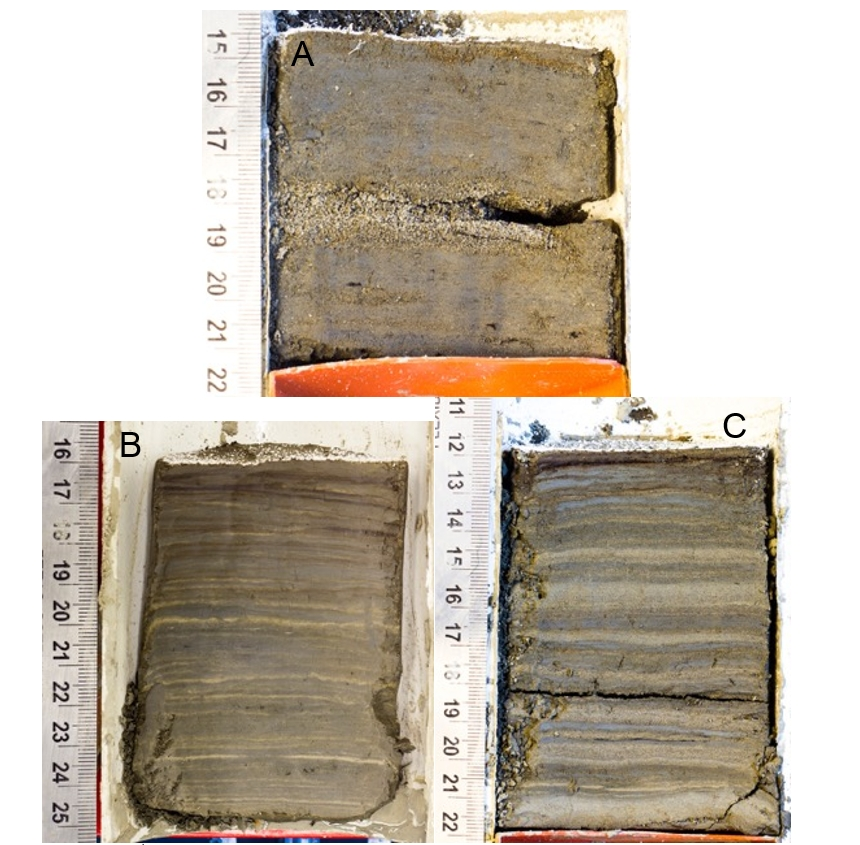

## Introduction

Records of the magnitude and rate of change of the environment that extend beyond currently observable record are crucial to understanding the processes and environmental and societal impacts of current climate change [@Turney2019; @Huber2012; @Nelson2016]. Environmental reconstructions at the sub-annual (e.g. ice cores, tree rings, and corals), to multi-decadal (e.g. sediments, pollen, boreholes) have proven useful in describing past environmental conditions across the globe [@Masson2013]. Sedimentary sequences collected from glaciated watersheds have been important in contributing to regional understanding of climate and hydrologic variability over the late Holocene. Research by @Neukom2019 have utilized sedimentary sequences as part of larger paleolimnological collections to provide a reconstruction of temperature variability over the last 2000 years. Despite their importance, relatively few records have been collected across the globe. In Canada, recovered sedimentary sequences have been collected from geographically limited regions including: Squamish Valley, East of the Rocky Mountains. Few continuos sedimentary sequences have been collected from the Cariboo Mountain region. This study presents a new record of hydroclimatic variability over the past 10 k years by sub-bottom acousitc (coarse resolution), and 2 k years through sediment cores (~50-100 yr variability). 

## Study Area

Cariboo Lake is located in the northern foothills of the Columbia Mountains, 85 km northeast of Williams Lake, British Columbia Fig. \@ref(fig:map1). The lake receives runoff from an area of 3242 km^2^, and the watershed relief ranges from 2600 m asl in the headwaters to 600 m asl at the Cariboo Lake outlet. The Cariboo Lake watershed has 80 km ^2^ (as of 2017) of permanent ice cover which covers 2.4% of the total watershed. The most extensive glaciated terrain is proximal to Mt. Lunn roughly 60 km upstream of Cariboo Lake.

The Cariboo River, located on the east end of the lake provides the main source of sediment into the lake. The bathymetry of Cariboo Lake shows evidence of past glacial scouring, indicated by deep scour channels Fig. \@ref(fig:map2). The lake is separated into two main basins, by the Keithley Creek fan delta. The upstream basin is called the main Cariboo Lake basin, and the downstream basin is called the Keithley Creek basin. The bathymetry of the lake reaches a maximum depth of over 50 m in two scour channels within the central part of the main Cariboo Lake basin. 


```{r map1, echo=FALSE, fig.cap = "Map showing the Cariboo Lake basin."}
knitr::include_graphics("figs/intro/map-sc.png")
```

```{r map2, echo=FALSE, fig.cap = "Map showing the Cariboo Lake bathymetry and coring locations."}
knitr::include_graphics("figs/map.png")
```

Sediment connectivity to headwater glaciers along the Cariboo River is limited due to lake filtering by Lanezi and Sandy lake. Lanezi Lake is a deep fjord lake with a bathymetry reaching a maximum depth of 170 m. Sandy Lake is much shallower reaching a maximum depth of 6 m. The Matthews River, which meets the Cariboo River just below Lanezi Lake provides less filtered connection to meltwater from several alpine glaciers including the largest chunk of ice in the Cariboo Lake watershed, the Roberts Peak Galcier.

## Methods

*Field Methods*

A field campaign was conducted during the summer of 2017 to collect sub-bottom acoustic soundings, dredge samples, and sediment cores. Thirty-four km of sub-bottom acoustic soundings were collected across Cariboo Lake using a 10 kHz StrataBox 3510 HD. An Ekman dredge was used to collect 20 ~10 cm^3^ samples of sediment from the lake bottom. The dredge samples were subsampled in the field using an 80 mm diameter PVC cylinder pushed into the block of sediment. The remaining sediment was kept as a bulk sediment sample. Four sediment cores (V1-V4) were collected using a Rossfelder submersible vibracorer with a 6 m long 70 mm diameter aluminum pipe. The Ekman subsample cores and the vibracores were split longitudinally with one half preserved as an archive and the other as a workging half. The working half samples were prepared for imaging by scraping the core parallel to the sediment laminae to create a flat surface which showed the sediment stratigraphy. The stratigraphy of cores V1 and V2 were best preserved and were selected for detailed analysis. 

*Laboratory Methods*

Cores V1 and V2 were subsampled with 2 cm^3^ of sediment extracted at a 5 cm interval, with additional samples taken within stratigraphic breaks. The Ekman bulk samples and vibracores were analyzed for laminae thickness, organic content, and particle size. Laminae couplets were digitally counted and measured for thickness using the ImageJ @imageJcite software. Organic content was determined by loss-on-ignition analysis (550 °C) following methods in @Smith2003. Samples were first weighed to provide an initial wet weight, then dried at 60 °C and weighed again after oven drying. The samples were then placed in a furnace at 550 °C for 2.5 hours and weighed a third time. Grain size analysis was conducted using a Mastersizer Particle Size Analyzer 3000. Samples were prepared following methods by @Gray2010 to remove the fine fraction of particles from organic material. This involved a removal of organic material using three sequential alloquots of 20% H202 until the sample stopped reacting. To prevent flocculation of sediment grains the samples were dispersed in 0.05% solution of Calgon for 24 hours. The chronology of both cores was provided by AMS ^14^C dating of wood fragments at the André E. Lalonde AMS Laboratory at the University of Ottawa and varve chronology from laninae counting.

## Results

### Sub-bottom Acoustics

Acoustic stratigraphy from six selected transects conducted across Cariboo Lake reveal the range of morphologies and character of sedimentary deposits in Cariboo Lake (Fig. \@ref(fig:mapAcoustics)). Acoustic penetration is limited in coarser sediments from transects proximal to river fan-deltas across Cariboo Lake (see Fig. \@ref(fig:mapAcoustics) for fan-delta locations). Penetration, resolution and distinctive acoustic layering improves significantly along the thalweg of the lake bottom and in cross-lake transects more distal from the fan-deltas. Cross-hatching is observed over most of the acoustic record due to errant electrical interference from the research vessel. However, the interference does not affect the overall quality of the results in the six selected transects.

```{r mapAcoustics, echo=FALSE, fig.cap = "Map showing the Cariboo Lake bathymetry and Sub-bottom Acoustic Transects."}
knitr::include_graphics("figs/CaribooLake_AcousticsLine_Bathymetry_20200907.png")
```

Transect A, one kilometre southwest of the headwater Cariboo River delta, has a strong acoustic reflector at the sediment-water interface indicating the presence of coarser-grained material on the lakebed (Fig. \@ref(fig:acoustics), A). Grab samples on this transect show a high fraction of sandy materials which act as an acoustic mask limiting the penetration of the acoustic signal to a depth of 1-2 m. An acoustic multiple (echo) is observed 45 m below the sediment surface caused by the limited penetration at the surface (Fig. \@ref(fig:acoustics), A - i). Acoustically penetrable, well-layered sediment is observed 3.5 km from the Cariboo River delta in transect B (Fig. \@ref(fig:acoustics), B). Acoustic reflectors with 1-2 m spacing lies conformably over a hummocky basement, with a maximum observable sediment thickness of 15-20 m observed near the thalweg. Well structured layering extends across the south side of the transect but pinches out towards the north shore (Fig. \@ref(fig:acoustics)). Fig. \@ref(fig:acoustics) shows two channel-like depressions in this transect. 

```{r acoustics, echo=FALSE, fig.cap = "Panel of six selected sub-bottom acoustic transects A, B, C, D, E, and F. All transects are looking up-lake, see Fig. 2 for location. Transect A & B: Acoustic echo (multiple) is denoted by (i). Transect C: (i) denotes inferred bedrock or late-glacial material. (ii) and (iii) are v-notch scour channels. (A) and (B) are sediment facies. Transect D: Scour channels are denoted by (i) and (ii). Slumping is observed at (iii)."}
knitr::include_graphics("figs/CaribooLake_AcousticsLine_Bathymetry_20200907.png")
```

Acoustic penetration increases in locations about 4.5 km from the Cariboo River delta at transect C (Fig. \@ref(fig:acoustics), C). The acoustic record along this transect reaches a maximum sediment thickness of 35 m in two troughs - the maximum thickness of surficial sediments observed across Cariboo Lake in this study. The acoustic basement is considered to be either bedrock or coarse-grained glacial sediment from the Last Glacial Maximum (Fig. \@ref(fig:acoustics), C – i). Two sediment facies are observed across this transect based on geometry and the strength and continuity of reflectors. Some disruption of these facies is caused by slumping of side slopes (e.g. north end of transect C). The lower unit, facies A, has a thickness of ~ 12 m along undisturbed sections (Fig. \@ref(fig:acoustics), C - A) and is more massive to weakly acoustically layered. The contact with overlying sediment above facies A appears to be conformable at the south end and middle of the transect but unconformable in other places.  The unconformities are most apparent in the two sharp crested v-notch channels at the middle of the transect. These channels are a continuation of those noted in transect B. These are inferred to be scour channels formed by erosive, higher energy, turbidity currents that probably date to deglaciation of the lake basin.  The lack of numerous layers and generally lighter grey tone in facies A indicates a somewhat higher energy and more rapid deposition of coarser lacustrine sediment.  

Facies B begins with high-amplitude parallel reflectors with 2-3 m spacing and conforms well with facies A below, outside of areas of disturbance. (Fig. \@ref(fig:acoustics), C - B). Facies B has a thickness of ~ 10 m along undisturbed sections and deepens to a maximum of 13 m within the scour channels (Fig. \@ref(fig:acoustics), C - ii & iii). The strength of reflectors in facies B are stronger and more numerous than those in facies A indicating more frequent events of lower overall magnitude during this time period. The strength of reflectors gradually decreases moving upwards and spacing thins to sub metre near the surface. The gradual decrease in reflectance is interrupted by a strong reflector at the top of facies B along the sediment-water interface. 

The two buried troughs in transect C (Fig. \@ref(fig:acoustics), C - ii, iii) are significant and best expressed  in this area of the lake. The north trough (ii) appears to be a depression that was continuously infilled by facies A and then B. Hence it most likely represents an older pre-existing feature. The sediments in the southern trough (iii) are interesting in that a wedge of sediment infill seems to be an unconformable deposit with both facies B below and facies A above. It is likely that an erosional channel developed after or in the later stages of facies A deposition which infilled the wedge. Sedimentation of the wedge was then truncated by the onset of the facies B sediment. While the two troughs might have been active at the same time during deglaciation, only the southern trough was reactivated at a later time and infilled with sediment prior to the onset of facies B deposition.

Transect D, to the northeast of the Frank Creek delta has well-layered sediments in the top 5-10 m and transitions to poor acoustic penetration below this (Fig. \@ref(fig:acoustics), D). The parallel reflectors observed in the uppermost sediment layers of transect D have a thickness of 2-3 m and have a higher amplitude compared to facies B in transect C. Some slumping of sidewall sediments is observed on the south sidewall (Fig 6, i).

Southwest of the Frank Creek fan-delta, acoustic reflectors along transect E show a decline in reflectance and a decrease in layer thickness to < 1 m. Acoustic masking from course grained sediment occurs at depths of 2-4 m along the south margin (Fig. \@ref(fig:acoustics), E). Total sediment thickness of finer, acoustically well-layered material along the north bench is significant approaching 10 m.  The sedimentary environment southwest of the Frank Creek delta is comparably different to transects northeast of the delta. The profile suggests that much of the suspended sediment transported from the upper lake does not make it past the shallow lake depths (< 20 m) of the sill at the Frank Creek fan-delta apart from the northern most part of the transect. So, coarser sediment from the Frank Creek fan-delta dominates the south side of the transect and fine sediment deposition is restricted, or forced, to the north side. The Coriolis effect may enhance this as suspended sediments are deflected to the right as they enter Cariboo Lake from Frank Creek. 

Similar to the Frank Creek fan-delta, the very shallow sill of less than 2 m opposite the Keithley Creek prograding fan-delta significantly reduces sediment connectivity to the main Cariboo Lake basin. (Fig. 1). Transect F, located close to the centre of the Keithley Creek sub-basin shows a maximum observable sediment thickness of 4 m concentrated in the basin thalweg (Fig. 8). Below this there is acoustic masking by coarser grained sediment. The acoustic reflectors within the top 4 m of transect F are acoustically penetrable, well layered and are conformable to the basin morphology. These reflectors are of higher amplitude compared to those in transect E and are thicker at 1-2 m. This suggests that significant amounts of coarse-grained sediments are found in this part of the lake, likely originating from the high energy Keithley Creek drainage basin. Fine faction sediments from the main Cariboo Lake are expected to make up a small percentage as transport into this sub-basin is limited by up-lake storage and filtering. 

### Spatial Trends in Surficial Sediment

Twenty surficial sediment cores ranging from 6-12 cm thick were analyzed for grain size, laminae thickness, and organic content. These samples were collected following a longitudinal transect down Cariboo Lake and indicate how sediment flux varies with distance from the Cariboo River delta (Fig. \@ref(fig:map2), n = 20). Proximal to the Cariboo River delta (< 500 m) the structure of the surficial sediments exhibits massive layering, erosive contacts and the fraction of sand grains in these samples is greater than 60 % (Fig. \@ref(fig:ekman-dist-perc)). A sand bed with a thickness of 1 cm is observed in the bulk sample closest to the Cariboo River delta (Fig. \@ref(fig:ekman-imgs), A). The D50 grain size follows a steep decline from 89.9 μm 300 m from the delta to 31.3 μm 550 m from the Cariboo River delta (Fig. \@ref(fig:ekman-um)). The decrease in grain size generally continues further down-lake besides samples retrieved near river deltas. A small increase in D50 is observed proximal to the Pine Creek delta from a low of 21.5 μm at 1.1 km, up to 28.2 μm 1.83 km from the main Cariboo River delta (Fig. \@ref(fig:ekman-um)). At distances greater than 2 km from the Cariboo River delta the fraction of silt grained sediments remains over 80 %, aside from core E16 which is near the Frank Creek delta (Fig. \@ref(fig:ekman-dist-perc)).  Proximal to the Frank Creek delta the D50 grain size nearly doubles in size from 7.92 μm at 6.4 km to 15.1 μm at 7.35 km from the Cariboo River delta. In main Cariboo River sub-basin, the most well-preserved core was taken 5.24 km from the Cariboo River delta in the deepest part of the sub-basin at a depth of 40 m and shows rhythmically laminated sediments (Fig 6, b). In the Keithley Creek basin the D50 grain size has an average of 15.9 μm (n = 3) and the composition of sediment 4.0% clay, 85.8% silt, and 10.2% sand (Fig 5, Fig 6 - C). 

```{r ekman-um, echo=FALSE, fig.cap = "Ekman bulk sample grain size diameter versus distance from the Cariboo River delta. (A) D90, (B) D50, (C) D10."}

```

```{r ekman-imgs, echo=FALSE, fig.cap = "Selected surficial Ekman sediment core photographs. A (E1) is proximal to the Cariboo River delta. B (E13) was retrieved from the second deepest basin in the lake in the Cariboo River basin. C (E18) was retrieved from the Keithley Creek basin."}

```

Sediment cores E9-E15 and E18-E20, retrieved from areas in Cariboo Lake that are distal from river deltas, and have a high fraction of silt and clay sediment, exhibit a sequence of fine-grained dark layers followed by coarse-grained light layers (Fig. \@ref(fig:ekman-imgs)). The thickness of sediment laminae within these surface cores demonstrate a gradual decreasing trend with distance down-lake from the Cariboo River delta (Fig. \@ref(fig:ekman-varve)). Maximum varve thickness has an average of 4.7 mm (n = 6) in the Cariboo River basin and 7.9 mm (n = 3) in the Keithley Creek basin. In the Cariboo River basin, maximum varve thickness decreases by 0.62 mm/km and by 2.17 mm/km in the Keithley Creek basin with distance down-lake (Fig. \@ref(fig:ekman-varve)). This decrease in laminae thickness with distance from the delta is attributed to the Cariboo River being the main source of sediment into Cariboo Lake as sediment flux typically declines with distance from the primary sediment source. The decline in thickness is steeper in the Keithley Creek Basin likely due to additional local inputs of coarser grained sediment coming from the Keithley Creek tributary which are not transported as far as suspended sediments. 

```{r ekman-varve, echo=FALSE, fig.cap = "Laminae Statistics calculated on surficial Ekman cores E9-15 and E18-E20.. (A) D90, (B) D50, (C) D10."}

```

```{r ekman-loi, echo=FALSE, fig.cap = "Ekman bulk sample percent loss on ignition versus distance from the Cariboo River delta. "}

```

Trends in percent organic content of surficial sediment cores where not found to exhibit systematic patterns with distance down-lake (Fig.9). However, higher %LOI values were observed close to the main Cariboo River delta, likely due to the relatively low levels of erosion and high levels of allochthonous organic matter entering the lake. The lowest %LOI values were observed in the Keithley Creek basin which suggest higher levels of erosion in this basin. 
The results from particle size, laminae thickness, and percent organics suggest that sediment delivered from the main Cariboo River is the primary source of sediment to Cariboo Lake. Massive layering of sediment and coarse-grained particle sizes are limited to areas proximal to Pine Creek, Frank Creek and Keithley Creek deltas where turbidity currents are active. Outside of these areas, where turbidity currents and bedload transport processes are reduced, the sediment in Cariboo Lake is largely comprised of rhythmically laminated silt and clay sediments likely transported primarily through suspended sediment currents from the main Cariboo River. In the Keithley Creek basin grain size and laminae structures are larger in size than those observed in the main Cariboo River basin suggesting sediment inputs from the Keithley Creek are significant (Fig. \@ref(fig:ekman-imgs), C). 