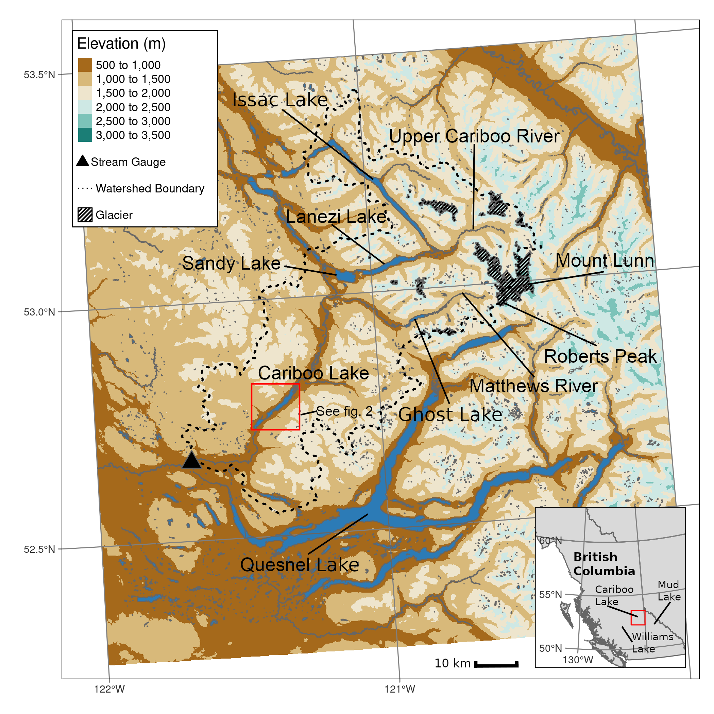
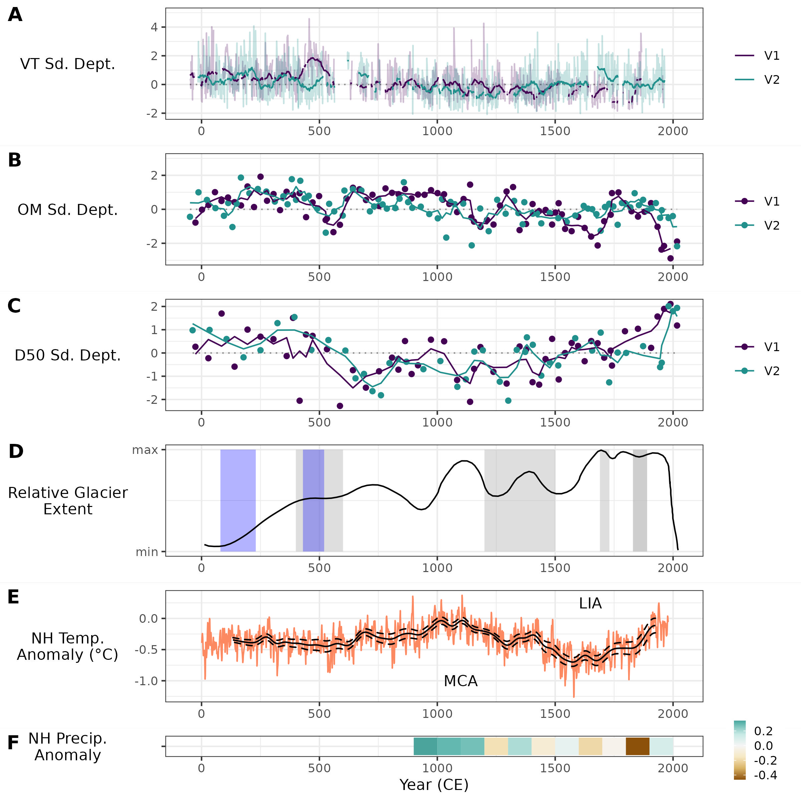

```{r setup, include=FALSE}
library(dplyr)
knitr::opts_chunk$set(echo = F, warning = F, message = F)
knitr::opts_chunk$set(out.width = "100%", fig.align = 'center')
```

# Introduction

Environmental proxies that extend back beyond the modern observable record are crucial to understanding earth system processes [@Turney2019; @Huber2012; @Nelson2016]. Proxy reconstructions at the sub-annual scale (e.g. ice cores, tree rings, and corals), to multi-decadal scales (e.g. sediments, pollen, boreholes) have proven useful in describing past environmental conditions across the globe [@Masson2013]. In the case of sedimentary sequences collected from climate sensitive glaciated watersheds, they have been important in contributing to the regional understanding of climate and hydrologic variability over the Holocene. For example, research by @Neukom2019 have utilized sedimentary sequences as part of larger paleolimnological collections to provide global reconstructions of temperature variability over the last 2000 years. 

The climatic setting in western Canada over the Holocene contributed to several fluctuations in glacial activity with implications for sediment accumulation in glacier-fed lakes. Multi-proxy analyses of lake sediments from Vancouver Island [@Brown2006], south central British Columbia [@Lowe1997] and northern Washington [@Steinman2019] suggest low lake levels and precipitation amounts during the early Holocene around 11.0 to 7.50 ka. Glacier extents in western Canada during the early Holocene in the southern Coast Mountains [@Menounos2004; @Koch2007a; @Osborn2007] and Canadian Rocky Mountain [@Luckman1988; @Luckman1993] have been found to be reduced relative to the late Holocene. During the Early Neoglacial (7.50-5.00 ka), glaciers increased in extent in the south Coast Mountains [@Osborn2007; @Filippelli2006; @Ryder1986] with some limited evidence in the Interior ranges and Rocky Mountains [@Luckman1993]. During the Early-middle Neoglacial (5.00-3.50 ka), there is widespread evidence of at least two glacial advances across western Canada from material dated in glacial forefields and clastic sedimentation [@Koch2007a; @Osborn2007; @Menounos2008c; @Gardner1985; @Wood2004; @Hodder2006b; @Desloges1999; @Leonard1999]. During the Middle-late Neoglacial (3.50-1.00 ka), two periods of glacier advance have been reported. In the central and eastern ranges of Canada, records support extensive glacier coverage around 3.5-2.77 ka and 1.8-1.5 ka from lacustrine sediment [@Leonard1999; @Leonard1997; @Dirszowsky1997a; @Desloges1999] and from log and stump material between [@Wood2004; @Luckman1995; @Luckman1999]. The Little Ice Age (LIA) includes glacier advances over the past millennium and have been reported as broadly synchronous from Alaska to Patagonia [@Luckman2000e]. In the Canadian Rocky Mountains many glaciers reached peak glacier extents during the LIA, and are estimated to be centered around CE1250 [@Luckman1995; @Osborn2001; @Leonard1997] and CE1850 [@Luckman2000e; @Leonard1997]. Over the Holocene there is general regional agreement on the timing and magnitude of the large Early Holocene retreat and Late Holocene LIA advance however, the smaller fluctuations that occurred between these large events have less regional agreement [@Menounos2009b].  

In the western Cordillera of Canada, recovered sedimentary sequences have been collected to better understand the hydroclimatic and glacial history of the Coast Mountains [@Menounos2008c], St. Elias Mountains [@Crookshanks2008], Monashee Mountains [@Hodder2006b], and Rocky Mountains [@Leonard1986; @Dirszowsky1997a; @Desloges1999]. A study of Quesnel Lake (272 km^2^), 30 km south of the study area examined here, by @Gilbert2012 found deglacial, and the very earliest Holocene, sediment infills to be high at around 10.4 ka BP, declining significantly at around 8.4 ka BP. Trends in Quesnel Lake sediment characteristics during the Holocene were not detectable as accumulation rates were very low in the areas of the lake that could be sampled. Quesnel Lake is very large relative to the contributing watershed and therefore the sediment system is much less sensitive to climate variability. Aside from the @Gilbert2012 study on Quesnel Lake, records of holocene glacial and hydroclimatic variability have been primarily collected proximal to the Coast and Rocky Mountains. Additional records for the transitional climate between these two mountain ranges are needed especially during the mid to late Holocene where greater regional variability in the glacial and climate response has been observed [@Steinman2019; @Menounos2009b].

**Previous studies glacier-fed lakes have had success relating lake bottom sediment archives (e.g. varves, grain size and organic content) to changes in regional temperature, precipitation patterns, and glacier extent over the Holocene [@Desloges1999; @Hodder2006b; @Leonard1997; @Menounos2006b; @Menounos2008c]. Mountain basins that exhibit a distinct nival-hydrographic regime typically produce distinct varve couplets with a fine-grained layer deposited in winter when the lake ices over and flow velocity decreases followed by a coarse-grained layer deposited during spring high flows [e.g. @Leonard1997; @Hodder2007c; @Desloges1999]. In contrast, Lakes proximal to the coast of British Columbia typically show a higher degree noise in their varve record due to the influence of multiple large fall rain storms (Atmospheric Rivers) that produce multiple coarse laminations within a single season [e.g. @Gilbert1997; @Menounos2008c]. This can result in a much larger coarse grain fraction compared to the fine grained and may lead to reduced sensitivity to watershed wide climate and glacial signal.**

**Lakes that are more distal from glacier activity typically have relatively lower sediment inputs, due to the upstream filtering of rivers and/or lakes which limits the coarser fraction of sediment but still allow some input of the fine fraction [@Hodder2007c]. The effect of this filtering effect on the climate and hydrology signal may contribute to a weak signal to noise ratio and reduced sensitivity to hydroclimatic variability if local sediment sources outweigh the delivery of sediment from headwater sources [@Jerolmack2010]. However, lakes with moderate upstream filtering that maintain a high fraction of fine clastic sediments produced in the glaciated headwaters are likely to maintain sensitivity to the hydroclimatic signal of the basin.**

**Establishing a correlation between seasonal or annual trends in varve thickness, grain size, and organic content from sediment cores to local discharge, temperature, and precipitation is not always possible due to complex process interactions [@Hodder2007c; @Menounos2008c; @Heideman2017]. @Hodder2007c describes the process systems that may influence the variability in sediment delivery to a lake which include: climate, glacier, fluvial, geomorphic, terrestrial biologic, and lacustrine systems. Due to the multiple interactions between these systems, the linkage between the lake sediment signal and climate is typically weak at time scales less than 10 years [@Hodder2007c; @Menounos2008c; @Heideman2017]. Trends in lake sediment sequences are typically more representative to climate fluctuations at longer time scales over over 100 years [@Leonard1999; @Osborn2007; @Heideman2017].**

**The chronology of sedimentary sequences in prior studies are typically derived from a combination of radiocarbon dating [@Gilbert2012; @Hodder2006b; @Steinman2019], identification of volcanic tephra layers [@Gilbert2012; @Hodder2006b; @Steinman2019] and counting of visable annual laminations (varves) [@Hodder2006b; @Heideman2015]. The Mt. Mazama vocanic eruption is the most prominent tephra layer typically found in sediment sequences in western Canada [@Gilbert2012; @Steinman2019] and has been dated to roughly to have an age of 7600 cal. BP [@Zdanowicz1999; @Hallett1997]. @Westgate1977 reports the most recent major volcanic ash event to reach central BC occurred 2100 yr BP, predating the basal age of the four sediment cores presented in this study. Younger sedimentary sequences, for example the 825 year record collected from Lillooet Lake, British Columbia, have provided chronologies using a combination of varve counting and radiocarbon dating in the absence of discernable tephra layers.**

**In addition to sedimentary sequences, acoustic remote sensing of lake bottom sediments is another method that has been used successfully to reveal the history of sediment infill [@Desloges1994d; @Hodder2006b; @Gilbert2012; @VanRensbergen1999]. Acoustic profiles of lake-bottom sediments provide information about facies in the sediment stratigraphy using variations in sound propagation [@LeBlanc1992]. The acoustic profiles may also provide coarse resolution (~1000 yr) data regarding differences in the grain size of sediment [e.g. strong acoustic reflectors correlated to an energetic sedimentary environment in @Hodder2006b].** 

**Few sedimentary sequences exist in central British Columbia that provide a high resolution and long term record of hydroclimatic variability [@Gilbert2012; @Hodder2006b]. The sedimentary sequence from Cariboo Lake presented here, fills this gap by providing a new record of Holocene hydroclimatic variability for the transitional zone between the Coastal and Rocky Mountains using lake bottom sediment records recovered using sub-bottom acoustic methods and long sediments cores.**

The purpose of this research is to 1) establish an understanding of the mechanisms that control the delivery and deposition of the fine sediment fraction to Cariboo Lake, 2) to reconstruct the highest resolution and longest term sediment accumulation record possible for this area of British Columbia, 3) compare and contrast the accumulation record in this transitional (semi-arid to glaciated mountainous) lake system with existing sedimentary sequences and regional climate proxies in western Canada.

# Study Area

Cariboo Lake is located in the northern foothills of the Columbia Mountains, 85 km northeast of Williams Lake, British Columbia (Figure \ref{fig:map-basin}). The lake receives runoff from an area of 3244 km^2^, which is filtered by three deep fjord like lakes Issac Lake, Lanezi Lake, and Ghost Lake shown in Figure \ref{fig:map-basin}. The watershed relief ranges from 2600 m asl. in the eastern headwaters to 600 m asl. at the western Cariboo Lake outlet. The west to east, 90 km long watershed spans climate ranging from 1370 mm/yr in the headwaters to 477 mm/yr at the semi-arid outlet to the lake. The area of Cariboo Lake is 10 km^2^ resulting in a lake area-to-watershed area ratio of 0.3%. The Cariboo Lake watershed has 64 km^2^ of permanent ice cover which covers 2% of the total watershed [@Bolch2008]. The most extensive glaciated terrain is proximal to Mt. Lunn roughly 60 km upstream of Cariboo Lake (Figure \ref{fig:map-basin}). **The Cariboo Lake basin hydrology is snow- and glacier-melt dominant with average 1971-2000 monthly runoff peaking in June and low-flows occur between December and March (Figure \ref{fig:cl-hydro}, A). From December to March the air temperature is mostly below 0 °C and precipitation falls primarily as snow during these months (Figure \ref{fig:cl-hydro}).**

The Cariboo River, draining into the east margin of the lake, is the main source of sediment. The lake is separated into two basins, by a large alluvial fan building cross-valley from Keithley Creek (Figure \ref{fig:map-lake}). The surface area of the upstream basin is 8 km^2^ and is referred to here as the main Cariboo Lake basin. The downstream basin, referred to here as the Keithley Creek sub-basin, is 2 km^2^ in surface. The bathymetry of the lake reaches a maximum depth of over 50 m in two deep holes within the central part of the main Cariboo Lake basin. **These deep holes provide some evidence of past glacial scouring and ice extents that reached the lake.**

```{r map-basin, echo=FALSE,out.width = "100%", fig.cap = "Map of the Cariboo Lake basin. Inset map shows the location of the Cariboo Lake basin within British Columbia relative to the Mud Lake basin from the Hodder et. al, (2006) study. See Figure 2 for detailed map of Cariboo Lake."}

```

```{r cl-hydro, echo=FALSE,out.width = "100%", fig.cap = "1971-2000 monthly runoff statistics for Water Survey of Canada station 08KH003 (A) and 1971-2000 temperature and precipitation normals from Environment Canada station 1094616 (B). The top of each bar on panel C corresponds to the average monthly total precipitation and the coloured portion shows the fraction of rain or snow."}
knitr::include_graphics("figs/cariboo_combine_climate_hydro.png")
```

Sediment connectivity to headwater glaciers along the Cariboo River is limited due to lake filtering by Lanezi and Sandy lake (Figure \ref{fig:map-basin}). Lanezi Lake is a deep fjord-like lake with a bathymetry reaching a maximum depth of 170 m. **The flat lake bottom bathymetry of Lanezi lake suggests sediment delivery to this lake has been relatively high over the Holocene.** Sandy Lake is much shallower reaching a maximum depth of 6 m. The Matthews River, which meets the Cariboo River just below Lanezi Lake provides a less filtered connection to meltwater sources draining several alpine glaciers including the largest area of ice (10 km^2^) in the Cariboo Lake watershed, proximal to Roberts Peak (Figure \ref{fig:map-basin}).

```{r map-lake, echo=FALSE, fig.cap = "Map of the Cariboo Lake bathymetry and coring locations. Bathymetric interval is 10 m. Acoustic transects selected for analysis are shown with a black solid line and labeled A, B, C, D, E and F. Fan deltas mentioned in the text are represented by black triangles and are referenced to by the upstream creek (i.e. Frank Creek Delta is the triangle below Frank Creek). The Frank Creek fan delta separates the main Cariboo Lake and Frank Creek sub-basins. The Keithley Creek fan delta separates the Frank Creek and Keithley Creek sub-basins."}
knitr::include_graphics("figs/cl_bathymetry_acoustics_coring_locations_labels.png")
```

# Methods

## Field Methods

A field campaign was conducted during the summer of 2017 to collect sub-bottom acoustic soundings, dredge samples, and sediment cores. Thirty-four km of sub-bottom acoustic soundings were collected across Cariboo Lake using a 10 kHz StrataBox 3510 HD. An Ekman dredge was used to collect 20 samples from the lake bottom, each yielding ~730 cm^3^ of surficial sediment. The dredge samples were sub-sampled in the field using an 80 mm diameter PVC cylinder pushed into the block of sediment. This resulted in 20 short cores each containing about 450 cm^3^ of sediment. **The Ekman dredge filled with variable depths of sediment and as a result the short cores ranged from 6 to 12 cm in length.** The remaining sediment not captured in the PVC cylinder was kept as a bulk sediment sample. Four long sediment cores (V1-V4) were collected using a Rossfelder submersible vibracorer with a 6 m long 70 mm diameter aluminum pipe. The Ekman short cores and the long vibracores were split longitudinally with one half preserved as an archive and the other as a working half. The working half samples were prepared for imaging by scraping the core parallel to the sediment laminae to create a flat surface which showed the sediment stratigraphy. **The stratigraphy of long cores V1 and V2 were selected for detailed analysis as they were located within the deepest two basins of Cariboo Lake. The deep sampling location was important to ensure a higher fraction of fine clastic sediments delivered via overflow currents from the main Cariboo River compared to coarser sediments from valley sidewalls and turbidite flood events. Cores V3 and V4 taken at shallower depths had a higher fraction of coarse grained sediments and resulted in a higher degree of core disturbance, presumably due to the lower cohesion of the coarser grained sediments.**

## Laboratory Methods

The cores and short cores were analyzed for laminae thickness, organic content, and particle size. The working halves of long cores V1 and V2 were subsampled with 2 cm^3^ of sediment extracted at a 5 cm interval, with additional samples taken within stratigraphic breaks. Stratigraphic breaks were identified based on visual changes in grain size and lamination patterns. Laminae couplets observed on the **working halves** were digitally counted and measured for thickness using the ImageJ software, by @Schneider2012. **Uncertainty in laminae counting is attributed to sections of core with indiscernible laminae formation, core compaction, undercounting, and subjectivity in classifying the occasionally thicker (4 to 47 mm thick) graded to massive laminae/beds. Varve counting uncertainties in the literature are reported as 0.7 - 6 % from @Menounos2008c and @Birlo2022 respectively and are typically calculated using marker varves. An uncertainty estimate was not possible to attribute to the Cariboo Lake long-core laminae counting since there were no clear marker varves or tephras observed in the sediment cores.** The top section of cores V1 and V2 were disturbed during coring - 110 mm for V1 and 70 mm for V2 which prevented counting and measurement of laminae couplets. Organic content was determined by loss-on-ignition analysis (550 °C) following methods in @Smith2003. Samples were first weighed to provide an initial wet weight, then dried at 60 °C and weighed again after oven drying. The samples were then placed in a furnace at 550 °C for 2.5 hours and weighed a third time. Grain size analysis was conducted using a Mastersizer Particle Size Analyzer 3000. Samples were prepared following methods by @Gray2010 to remove the fine fraction of particles from organic material. This involved a removal of organic material using three sequential alloquots of 20% H~2~0~2~ until the sample stopped reacting. To prevent flocculation of sediment grains the samples were dispersed in 0.05% solution of Calgon for 24 hours. Grain size was measured three times for each sample, resulting in an average standard deviation of +/- 0.01 µm. The chronology of both vibra cores was reconstructed using AMS ^14^C dating of three wood fragments (analyzed at the André E. Lalonde AMS Laboratory at the University of Ottawa) and a chronology derived from laminae (couplet) counting on working core images. The AMS ^14^C calibration was performed using Bchron, a Baysesian statistical age-model software package for R [@Parnell2008; @Parnell2011; @Haslett2008] and the IntCal13 calibration curve [@Reimer2013]. 

# Results

```{r child = 'acoustic_results.Rmd'}
```

```{r child = 'spatial_results.Rmd'}
```

```{r child = 'temporal_results.Rmd'}
```

# Discussion

Cariboo Lake was selected to test the utility of moderate sized glacier-fed lakes as archives of accessible long-term and high-resolution sedimentation input variability. Evidence of late Pleistocene deglaciation in the Cariboo Lake region is provided by coarse temporal resolution sub-bottom acoustic results. A maximum deglacial sediment thickness of ~35 m puts Cariboo Lake in the middle to lower range of Holocene sediment inputs in Canadian Cordilleran lakes [see detailed discussion in @Gilbert2012]. The study of smaller Mud Lake, in the Rocky Mountains to the east of Cariboo Lake (Figure \ref{fig:map-basin} – inset) was evaluated by @Hodder2006b, who found the early phases of deglaciation and lake sediment infill started just prior to 9.6 ka BP. @Gilbert2012 indicate deglaciation of the north and west arms of nearby Quesnel Lake was likely complete by 8.6 ka BP. @Menounos2009b pointed to the deglaciation of most of the Cordilleran ice sheet before 10.5 ka BP. The Cariboo Lake acoustic results contribute to this regional record however the inferred bottom dates present uncertainty in the actual timing. 

Unlike many other deglacial sediment packages in Canadian Cordilleran lakes, the sediment infill in Cariboo Lake has been subject to deep trenching during deglaciation and the early Holocene (Figure 3c). The troughs, with sediment infills occurring at different times, suggest the presence of highly erosive but intermittent bottom currents during deglaciation and into the very earliest Holocene. Energetic flow of cold sediment-rich meltwater flow would be required suggesting proximity of an actively retreating valley glacier. The absence of lower elevations moraines in the valley upstream of Cariboo Lake might indicate rapidly retreating ice into headwater locations. However, in general, moraines indicative of stagnant ice fronts in lower elevation settings are not common elsewhere throughout much of the eastern Cordillera suggesting that valley glacier development was limited [@Menounos2009b].

In contemporary ice-proximal lakes with extensive coverage of active glaciers, high accumulation rates have been observed to be between 0.5 m/a [@Crookshanks2008] and as high as 1 m/a [@Gilbert1997]. Similar high accumulation rates in the late-glacial are inferred to have occurred in Quesnel Lake [@Gilbert2012], resulting in a thick pre-Holocene sediment package. This evidence for high pre/early Holocene accumulation rates in Quesnel Lake from large dynamic glaciers suggests that high accumulation rates are also likely for Cariboo Lake during this time and is supported by the acoustic data presented here. 

Sub-bottom acoustic records from Transect B shown in Figure \ref{fig:acoustics}, which is proximal to the V1 core, indicate an upward transition from massive-unlayered (Facies A) to well-layered sediments (Facies B) at a depth of about 20 m. Assuming a maximum Holocene sediment accumulation rate of approximate 1.9 mm/yr from V1, this would put this transition at about 10.5 ka BP. The massive structure of Facies A is inferred to be due to high rates of sediment delivery as glaciers retreated upvalley during the early Holocene after the formation of the deep trenches. The well-layered sediment of Facies B, along with the continuation of laminae couplets observed in cores V1 and V2 over the last 2 ka, suggests that glaciers reduced in extent at the start of the Holocene but did not disappear completely. It is possible during this transition from Facies A to B, glaciers retreated above Lanezi Lake resulting in a more sediment filtering and thus a reduction in sediment delivery and the beginning of seasonally derived laminae couplet formation within Cariboo Lake. 

Transect C, shown in Figure \ref{fig:acoustics} is located in-between cores V1 and V2, has ~15 m of well layered sediment overlying a massive unlayered lower Facies A. Using a combined V1 and V2 average Holocene sediment accumulation rate of 1.7 mm/yr in this region of the lake, puts the transition from Facies A to B at around 9 ka BP, slightly later than the Transect B estimate. However, sediment accumulation rates is generally lower across western Canada prior to the Neoglacial, due to widespread glacial activity and warm temperature during the early Holocene [@Steinman2019; @Menounos2004; @Koch2007a; @Osborn2007; @Luckman1988; @Luckman1993]. Therefore, the estimated basal ages of Facies A and B, estimated from sedimentation rates over the last 2 ka from the long cores presented here, may be much older if the actual sedimentation rates were used. The timing of the transition between these two facies is similar to the onset of deglaciation and start of the Holocene sediment package within Mud Lake, BC [@Hodder2006b] around 9.6 ka BP, at Moose Lake, BC [@Desloges1999] around 10.3 ka BP, at Quesnel Lake, BC [@Gilbert2012] around 8.6 ka BP, and at the Upper Bow River, AB [@Leonard1999] around 11.7 ka BP. Warming in the early Holocene, around 9.10-6.70 ka BP in the Canadian Rockies, specifically, [@Luckman1986] and British Columbia, generally, [@Clague1989; @Steinman2019] led to two possible sedimentation regimes. Where glaciers persist in the Canadian Rockies through the warm period resulting in more regular seasonality of sediment inputs and laminae couplet formation [e.g. Mud Lake, @Hodder2006b] and where glaciers disappear during the warm period, leading to much lower accumulation and seasonality [e.g. Moose Lake, @Desloges1999].

Records of sub-bottom acoustic records from Cariboo Lake present coarse temporal scale resolution of continuous sedimentation rates throughout the Holocene. Higher resolution AMS dated sediments from the much thinner sediment package in the west arm of Quesnel Lake, located in the Cariboo Mountains (Figure \ref{fig:map-basin}), also showed a very consistent mean rate of sedimentation throughout the entire Holocene [@Gilbert2012]. Contrasting somewhat from this pattern are results from @Menounos2004 and @Desloges1999 who note that early to mid-Holocene sediment accumulation rates in the southeastern Canadian Cordillera were lower than the late-Holocene Neoglacial period. However, those shifts come from watersheds with much higher percentages of glacier ice cover (~15-40%) coupled with the probable disappearance of glaciers during the warmer hypsithermal. Therefore, any extrapolation of timing to the early sediment record of Cariboo Lake remains speculative.

Sediment inputs to Cariboo Lake are mainly delivered via the Cariboo River delta and thus changes in watershed-wide temperature and precipitation trends would be expected to be important. In contrast, inputs of sediment from the small tributary watersheds that boarder Cariboo Lake are controlled by more localized, watershed-specific responses. Although coarser grained sediments from discrete turbidite flows are found proximal to sidewall tributary deltas (Figure \ref{fig:ekmanSeds}), they are only transferred to deep lake deposits during episodic events (Figure \ref{fig:turbScatter}). The long core (V1 and V2) sediment is composed of nearly 99% silt and clay resulting in laminae couplets that are inferred to have been delivered via suspended sediment from the main Cariboo River. Therefore, trends observed in sediment accumulation at cores V1 and V2 likely best represent waterside-wide climate and glacier activity. 

While cores V1 and V2 do not produce identical results, it is likely the sediment yield data from these cores are within the range of 7-21% error reported in Evans and Church (2000) for other alpine lakes in British Columbia. The inferred error of cores V1 and V2 is attributed to the spatial heterogeneity of sediment accumulation across the Cariboo Lake, and is likely on the lower end of this error range due to its simple basin morphology. Retrieving more than two good long core sedimentary sequences, could have provided a better estimate in the error of sediment accumulation, however, the logistical demands of retrieving more cores prevented this.

There is a documented range of late Holocene clastic sediment accumulation rates in glacier-fed lakes from across the Canadian Cordillera. Highest rates of > 2 cm/yr are observed in ice-contact to ice-proximal lakes of various sizes [@Desloges1994d; @Crookshanks2008], to relatively low rates of < 1 mm/yr [@Gilbert2012]. The range in accumulation rates has been understood to be a result in the variability of sediment production from glacier processes, the steepness of topography [@Ballantyne2002], the persistence of ice cover and the degree of basin connectivity enhancing or impeding delivery of sediment down valley [@Wohl2019]. 

In the Cariboo Lake basin, the combination of upper watershed area, intervening storage, glacier cover and lake size are considered optimal during this period for the relatively consistent formation of clastic varves. The Cariboo River has two main tributaries, the Upper Cariboo River and the Matthew River which are connected to high alpine peaks and glaciers providing a significant source of sediment (see Figure 2). Lanezi, Sandy and Ghost lakes act as sediment traps eliminating the transfer of coarse sediment and limiting the transfer of finer sediment from the glacier sediment production zones. This results in sediment accumulation rates that are on the low-end for the southeastern Cordillera [@Hodder2006b]. Although connectivity is limited, there are sufficient seasonal contrasts in suspended sediment flux to produce couplets (annual varves) in the main basin of Cariboo Lake over the last two millennia. This is unlike the west arm of Quesnel Lake where sediment rates are 2 to 3 times lower due to significant storage in the much larger upper watershed. 

Lake sediment chronologies typically vary in their sensitivity to regional fluctuations in temperature and precipitation, from annual resolution in lakes with higher accumulation rates [e.g. @Menounos2008c] to centennial-scale in lakes with low accumulation rates [e.g. @Desloges1999]. Figure \ref{fig:proxy-comparison}a shows the (inferred) varve thickness chronology reconstructed as standardized departures from cores V1 and V2. There is a significant amount of noise in the record, typical of a filtered sediment transport system [e.g. @Jerolmack2010], so a lower resolution 30-year moving average is superimposed on the raw couplet thickness data in Figure \ref{fig:proxy-comparison}a. Figure \ref{fig:proxy-comparison}b and \ref{fig:proxy-comparison}c show the lower-resolution temporal patterns in D~50~ grain size and organic matter content, respectively. These trends are compared against the @Moberg2005 regional climate proxy re-analysis for the northern hemisphere (Figure \ref{fig:proxy-comparison}d), @Solomina2016 western Canada peak glacier extent estimates (Figure \ref{fig:proxy-comparison}e), and @Ljungqvist2016 hydroclimate anomaly estimates for the northern hemisphere (Figure \ref{fig:proxy-comparison}f). Most of these are at resolutions of centennial scale or lower. 

**For Cariboo Lake, above average varve thickness, grain size, and organic matter are observed for both V1 and V2 from 0-700 CE. The advance and retreat of glaciers during the First Millennium advance around 200-500 CE is reported in the Coast Mountains [@Allen2007], Rocky Mountains [@Luckman1995; @Luckman1999; @Dirszowsky1997a; @Leonard1999], and more broadly across western Canada [@Solomina2016]. The increase in sediment production and availability in the system may be reflected here by the increase in varve thickness and grain size in the Cariboo Lake record (Figure \ref{fig:proxy-comparison}). Observations of an increase in clastic sedimentation rates were also observed at 200 CE in Hector Lake [@Leonard1997] and in Banff National Park [@Leonard1999]. Above average grain size and varve thickness are expected during a time of increased glacier extent due to higher rates of sediment production and delivery. However, the above average organic matter observed in Figure \ref{fig:proxy-comparison} is atypical during an increase of clastic sediment delivery, but could be explained by some contribution of increased soil erosion below treeline during a time of higher precipitation rates and subsequent high spring freshet flows.** 

**As temperatures warmed in the Pacific Northwest [@Steinman2012] and Northern Hemisphere [@Moberg2005] into the Medieval Climate Anomaly (MCA), a general glacier retreat phase is reported by @Solomina2016 from 700-900 CE across western Canada (Figure \ref{fig:proxy-comparison}, E). In the Cariboo Lake record, a decline in varve thickness and grain size is observed from 700-800 CE for both V1 and V2. Following this glacier retreat, there is evidence of an early Little Ice Age (LIA) glacier advance centering around 1250 CE [@Luckman1995; @Osborn2001; @Leonard1997]. However, changes in sediment characteristics in V1 and V2 during this period in do not appear to be sensitive to this change around 1250 CE (Figure \ref{fig:proxy-comparison}). The second glacier advance of the LIA, which centers around 1850 CE [@Luckman2000e; @Leonard1997] coincides with thicker and coarser varves, and reduction in organic matter in Cariboo Lake (Figure \ref{fig:proxy-comparison}). The change in varve thickness, grain size, and organic matter begins earlier for V1 at around 1750 CE compared to V2 which begins to change around 1825 CE. The discrepancy in the sediment characteristic trends between the two cores is considered small considering the uncertainty in the dating control of this study. Overall, the response of varve thickness, grain size, and organic matter to the second advance of the LIA around 1850 CE exhibits a stronger response compared earlier advances of the LIA. Temperature anomalies for the Northern Hemisphere reported by @Moberg2005, are also most negative from 1500-1750 CE. In @Steinman2012, dryer conditions from 1600-1900 are observed 500 km south of Cariboo Lake in Castor and Lime Lakes likely associated with colder temperatures. These records suggest how dramatic the LIA was compared to the rest of the 2 ka record. Following the LIA, around 2000 CE a dramatic decline in organic matter and increase in grain size is observed suggestive of high magnitude clastic sediment delivery. This could be attributed to the increase of sediment availability as glaciers retreated from LIA extents and exposed stores of clastic sediments [@Beedle2015]. However, hydraulic mining practices during the Cariboo Gold Rush and deforestation began during the late 1800s and may have contributed to these anomalies. This limits conclusions that increased glacier retreat observed in the Cariboo Mountains due to 20^th^ century warming [@Beedle2015] is the main cause.**

```{r proxy-comparison, fig.width = 8, fig.height = 11, fig.cap='Cariboo Lake sediment characteristics for cores V1 (purple) and V2 (green) and Northern Hemisphere (NH) climate proxies. A, is the standardized departure (Sd. Dept.) from the mean varve thickness (VT) for annual couplets (light colour) and 30-year moving average (dark lines). B, is the standardized departure from the mean D~50~ grain size, the coloured dots represent D~50~ grain size at 5 - 10 cm intervals and the coloured lines are the 3 sample (~125 year) moving average. C, is the standardized departure from the mean percent organic matter (OM) for cores V1 and V2. The coloured dots represent percent OM at 2.5 - 5 cm intervals and the coloured lines are the 3 sample (~75 year) moving average. D, Ljungqvist2016g, Sonechkin and Holmgren (2005) Nothern Hemisphere annual temperature anomaly from the 1961-1990 mean, the orange line is the full reconstruction from high and low frequency proxies, and the black line is the low frequency proxy component with upper and lower uncertainty marked by dashed blue lines. E, Solomina et al., (2016) periods of peak glacier extent in western Canada. F, Ljungqvist et al., (2016) Nothern Hemisphere hydroclimate variability, expressed as standardized unitless anomalies ranging from -2 to 2, relative to the centennial mean and standard deviation over the eleventh-nineteenth centuries (see methods for Fig. 5 in (Ljungqvist et al., 2016).'}
#readRDS('figs/2k-network/all_core_stats_2k_anomalies.rds')


```

# Conclusions

The moderated-sized Cariboo Lake provides a very good record of deglacial and Holocene sediment inputs for central British Columbia. The steep climatic gradient from the wetter, glacier covered, headwaters to the semi-arid, lower elevation zones of the lake, result in sediment input via the main Cariboo Lake delta that is predominately derived from the glacier production zone. This conclusion is supported by the down-lake trends observed in grain-size and organic matter content. The smaller alluvial-fan deltas from side tributaries appear to be paraglacial relic features, similar to those described in @Church1972, and likely formed during deglaciation and the earliest Holocene as no evidence of significant inputs during the Holocene were found in this study. 

  1. Sub-bottom acoustic records provide a coarse temporal resolution chronology of early and mid-Holocene sediment accumulation. **The transition of massive to well-layered sediments is estimated to have occurred around 10.5 to 9 ka BP. There is uncertainty with chronology of this transition as sediment accumulation rates from the 2 ka sediment cores were extrapolated to 10 ka BP.** Still, the 10.5 to 9 ka BP transition is similar to other glacier, lake and climate records across British Columbia and Alberta and suggests fairly consistent and rapid withdrawal of valley-bottom glacier ice into the highest elevation zones.
  2. There are still limitations in the ability to retrieve sufficiently long cores (> 10-15 m), that would provide a high resolution record of sediment inputs over the entire Holocene. If trends observed in other southern Canadian Cordilleran lakes prevail, the early and mid-Holocene input of sediment during the hypsithermal would have been significantly reduced resulting in a Holocene sediment package within the 10-15 m range. Acoustic Facies B most likely represents this unit. 
  3. Sedimentary structures in the long cores indicated sediment delivery over the late Holocene to present is dominated by similar fractions of silt (spring freshet) and clay (winter settling) resulting in the formation of rhythmically laminated couplets that are mainly varves. **Overflow currents in Cariboo Lake are inferred to be the dominant delivery mechanism of fine clastic sediments compared to other lakes in the Canadian Cordillera which typically have a larger fraction of coarse sediment from more frequent fall or spring high flows.** While there is relatively close agreement between sediment chronology from laminae counting and the two AMS dates, it is not possible to develop a chronology that provides a precisely dated sediment yield record over the last 2 ka. However, the observed mean accumulation rate (1.7 mm/yr), the variance in accumulation rate and the low-frequency trends are important indicators of late Holocene environmental change.
  4. Periods of peak glacier extent, such as during the First Millennial Advance (~ 200 to 700 CE) and Little Ice Age (~1600 to 1900 CE) are correlated with thicker and coarser varves in Cariboo Lake. We conclude that sediment accumulation in Cariboo Lake was more sensitive to glacier activity during the LIA compared to earlier advances. This is consistent with other records of glacier activity in the region which report a greater LIA response. Trends in organic matter content appear to be less correlated with watershed sediment delivery and may be more sensitive to vegetation changes in the basin.
  5. The greatest deviation in varve thickness, grain size, and organic matter above normal occurs after 1860 CE and may be related to climate warming following the LIA. However, there are complications in this watershed via large-scale mining proximal to the lake and some upper watershed deforestation. These land-use and land-cover changes may have also been contributing factors to an  increase in sediment delivery to the lake.

\pagebreak

# Acknowledgements

We thank Michael Allchin, Laszlo Enyedy, and Caitlin Langford at the Quesnel River Research Centre for assistance in field. Brian Menounos kindly provided access to vibra-coring equipment. Mike Gorton, George Kretschmann, Anna Soleski and Selina Amaral provided assistance with lab analysis of sediment samples. Funding was provided by the University of Toronto.

\pagebreak

# References