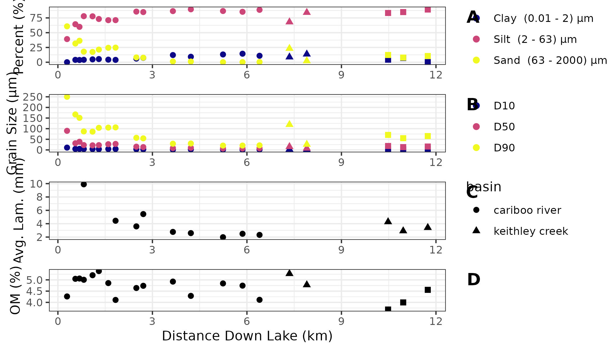
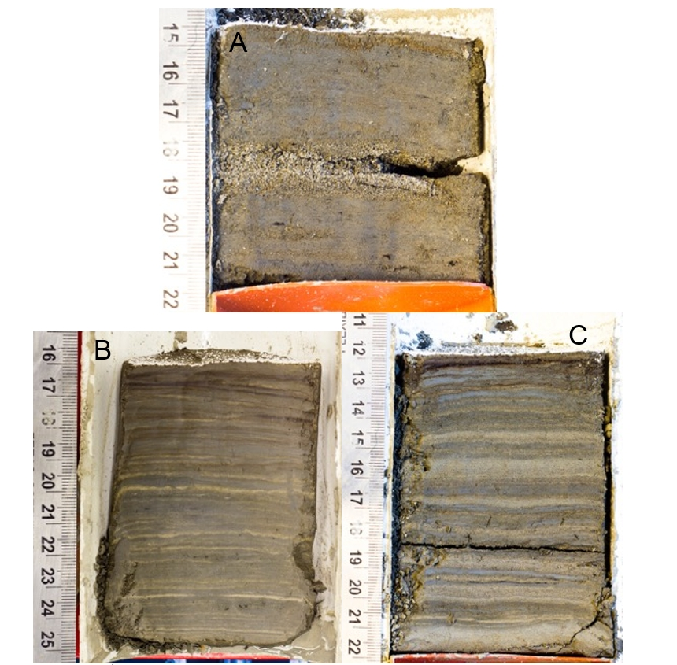

## Spatial Trends in Surficial Sediment {#spatial}

Twenty surficial sediment cores ranging from 6-12 cm thick were analyzed for grain size, laminae thickness, and organic content. These samples were collected following a longitudinal transect down Cariboo Lake and indicate how sediment flux varies with distance from the Cariboo River delta (see Figure \ref{fig:map-lake}, for sampling locations). **The percent of sand-sized sediments follows an exponential decline with distance down-lake starting at 60.8 % sand proximal to the Cariboo River delta and reaching a low of 0.15 %, 5.2 km km from the Cariboo River delta (Figure \ref{fig:ekmanSeds}, A). The D~50~ grain size also follows a steep decline from 89.9 µm, 300 m from the delta, to 31.3 µm 550 m from the Cariboo River delta (Figure \ref{fig:ekmanSeds}, B). The decline in D~90~ grain size follows a more pronounced decline, while the D~10~ remains largely unchanged. This suggests that larger sand-sized sediments (63-2000 µm) are sensitive to distance from fan deltas, while smaller silt-sized (2-63 µm) and clay-sized (0.01-2 µm) sediments are less sensitive. At distances greater than 2 km from the Cariboo River delta the fraction of silt-sized sediments remains at over 80 %, aside from core E16 which is near the Frank Creek fan-delta. The highest percent of silt (86.5-89.6 %) and clay (9.3-14.4 %) sized sediments are observed between 3 and 6.5 km from the Cariboo River delta, proximal to the long core sampling locations.** Near to the Frank Creek fan-delta the D~50~ grain size nearly doubles in size from 7.92 µm at 6.4 km to 15.1 µm at 7.35 km from the Cariboo River delta. In the Keithley Creek sub-basin the D~50~ grain size has an average grain size of 15.9 µm (n = 3) and the composition of sediment is 4.0% clay, 85.8% silt, and 10.2% sand (Figure \ref{fig:ekmanSeds}, A, B). 

Proximal to the Cariboo River delta (< 500 m) the structure of the surficial sediments exhibits massive layering, erosive contacts and the fraction of sand grains in these samples is greater than 60%. A sand-bed with a thickness of 1 cm is observed in the bulk sample closest to the Cariboo River delta (Figure \ref{fig:ekmanImgs}, A). In the main Cariboo River basin, core E13 had the most distinct laminations and was taken 5.24 km from the Cariboo River delta, proximal to long core V2, in the deepest part at a depth of 40 m. Sediment here shows rhythmic lamination (Figure \ref{fig:ekmanImgs}, B).

```{r ekmanSeds, echo=FALSE, fig.width=8, fig.height=5, fig.cap = "Sediment characteristics from the Ekman surficial bulk samples with distance down lake from the Cariboo River input to Cariboo Lake. Top panel A is the percent clay, silt, and sand grains, panel B is the  D~10~, D~50~, and D~90~ (µm) grain size, panel C is the mean laminae thickness (mm), and the bottom panel D is percent organic matter content (OM)."}

```

```{r ekmanImgs, echo=FALSE, fig.cap = "Selected surficial Ekman sediment core photographs. A (E1) is proximal to the Cariboo River delta (0.3 km down lake). B (E13) was retrieved from the second deepest basin in the lake in the Cariboo River basin (5.24 km down lake). C (E18) was retrieved from the Keithley Creek sub-basin (29.53 km down lake)."}

```

Sediment cores E9-E15 and E18-E20, retrieved from areas in Cariboo Lake that are distal from river deltas and have lake depths of 30-50 m, have a high fraction of silt and clay sediment and exhibit a sequence of fine-grained dark layers followed by coarse-grained light layers (Figure \ref{fig:ekmanImgs}, B & C). **The sediment stratigraphy observed within cores E9-E15 and E18-E20 is similar to annual laminations (also called varves) observed in many other lakes [@Cockburn2008; @Zolitschka2015a; @Heideman2015; @Hodder2006b; @Desloges1999] that have sufficient seasonal variation in river discharge and lake stratification. In the Cariboo Lake basin, winter low flows, lake-ice cover, and lake stratification reduce the velocity of lake currents and contribute to the deposition of fine-grained sediments on the lake bottom. During the spring nival high flows, coarser-grained sediments are deposited as a result of higher energy lake currents. Outside of spring, additional deposits of coarse-grained sediment may result due to abnormally high discharge events such as large rain or snow-melt events and/or turbidite beds due to delta collapse [@sabatier2022]. Coastal lakes in western Canada that are frequented by large rain storms and mid-winter melt events lead to multiple laminae couplets deposited in a given year [@Menounos2008]. However, the distinct snowmelt-dominant hydrological regime of the Cariboo Lake watershed shown in Figure \ref{fig:cl-hydro} suggests the deposit of multiple coarse-grained laminae in one year is rare. Coarse-grained deposits of sediment are still possible in Cariboo Lake due to turbidite beds from delta collapse however these turbidite beds are only observed in Ekman cores proximal to river deltas (e.g. \ref{fig:ekmanImgs}, A). While the sediment stratigraphy of Ekman cores E9-E15 and E18-E20 resemble varves, further analysis of the Cariboo Lake long-cores and C14 chronology is required to confirm this.**

The thickness of sediment laminae couplets within cores E9-E15 and E18-E20 demonstrate a gradual decreasing trend with distance down-lake from the Cariboo River delta (Figure \ref{fig:ekmanSeds}, B). This suggests the Cariboo River is the main source of sediment into Cariboo Lake as sediment flux typically declines with distance from the primary sediment source. Maximum couplet thickness has an average of 4.7 mm (n = 6) in the Cariboo River basin and 7.9 mm (n = 3) in the Keithley Creek sub-basin. In the Cariboo River basin, maximum couplet thickness decreases by 0.62 mm/km and by 2.17 mm/km in the Keithley Creek sub-basin with distance down-lake (Figure \ref{fig:ekmanSeds}, B). The decline in thickness is more rapid in the Keithley Creek sub-basin is likely due to additional local inputs of coarser grained sediment coming from the Keithley Creek tributary. 

Trends in percent organic matter (OM) of surficial sediment cores were not found to exhibit systematic patterns with distance down-lake (Figure \ref{fig:ekmanSeds}, C). **The lowest OM values were observed in the Keithley Creek sub-basin and suggest higher levels of clastic sediment yield in this basin which dilutes the OM.** 

The results from particle size, laminae thickness, and percent organics **supports the hypothesis that** sediment delivered from the main Cariboo River is the primary source of sediment to Cariboo Lake. Massive layering of sediment and coarse-grained particle sizes are limited to areas proximal to Pine Creek, Frank Creek and Keithley Creek deltas where localized turbidity currents are active. Outside of these areas, where turbidity currents and bedload transport processes are reduced, the sediment in Cariboo Lake is largely comprised of rhythmically laminated silt and clay sediments likely transported primarily through suspended sediment processes from the main Cariboo River. In the Keithley Creek sub-basin grain size and laminae structures are larger in size than those observed in the main Cariboo River basin suggesting local sediment inputs from the Keithley Creek are significant (Figure \ref{fig:ekmanImgs}, C). 