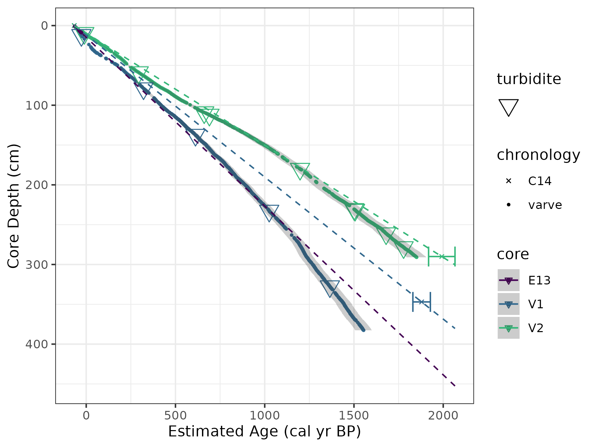
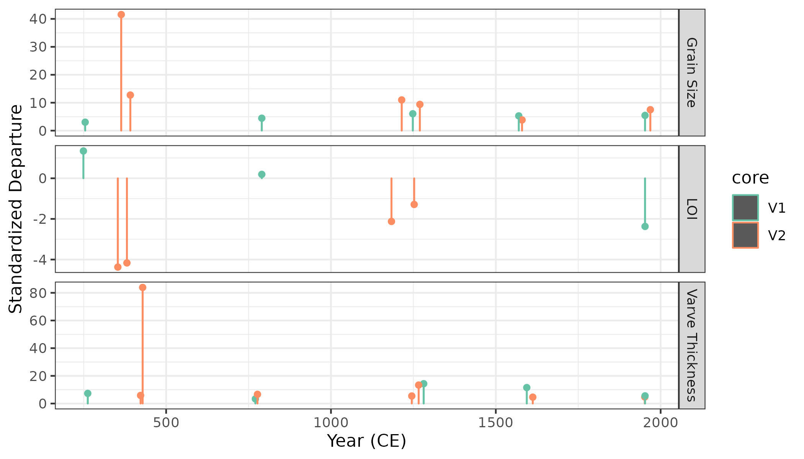

## Sediment Accumulation Chronology

Four vibra sediment cores, ranging from 2 – 4 m in length, were retrieved from the deepest portions of Cariboo Lake (Figure \ref{fig:map-lake}). Cores V1 (2.9 m) and V2 (3.8 m) in the main Cariboo River basin were selected for detailed analysis as these two cores had organic material for AMS radiocarbon dating, and their sedimentary record was well preserved. The chronology of the two cores is provided by a small number of AMS radiocarbon dates and laminae counting. No evidence of volcanic tephra was found within either of the two cores through visual color changes. **Since the most prominent ash deposits observed in western Canada predate the basal age of the two cores [@Westgate1977; @Hallett1997], smaller tephra layers within the core were not as easy to identify**. This combined with the dark colour of the clastic core sediments prevented finding smaller volcanic ash events within the cores. The chronology of the Cariboo lake core records of grain size, varve thickness, and organic content from these two cores demonstrate patterns in sediment delivery to Cariboo Lake over the past 2000 years.

### Chronology  

Organic material for dating in the clastic dominated cores was extremely limited. AMS radiocarbon dates obtained for cores V1 and V2 are presented in Table \ref{tab:amsDates} and provide limited temporal control and evidence of sediment accumulation rates for the long cores. A small twig from V1 at 347 cm and combination of two separate organic pieces which were combined into one sample at V2, a twig at 286 cm and a pine needle at 294 cm, yielding a calibrated [@Reimer2013] two-sigma date range of 1918-1820 cal BP and 2043‐1895 cal BP respectively. Figure \ref{fig:amsRates} shows the C14 chronology for V1 and V2 compared to the laminae couplet chronologies for E13, V1, and V2. The C14 dates from samples V1 and V2 yield consistent accumulation rates **(depth of sample divided by age of sample)** of 1.78 +/- 0.05 mm/yr and 1.41 +/- 0.05 mm/yr respectively. 

```{r amsDates, echo=F}
ams_meta <- readRDS('../data/long_cores/chronology/long_core_ams_meta.rds')
  
ams_meta |> 
  knitr::kable(
    caption = "Cariboo Lake chronologic control points.\\label{turbTbl}",
    col.names = c('Core Name', 
                  'Material', 
                  'Type', 
                  'Depth (cm)', 
                  '^14^C yr BP', 
                  '1$\\sigma$ uncertainty (yr)', 
                  '2$\\sigma$ calibrated age range (cal BP)',
                  'Median age (cal BP)'),
    align = 'l'
  )
```
```{r amsRates, echo=FALSE, fig.cap = "Cumulative sediment accumulation rates for cores V1 and V2 using the median calibrated C14 AMS dates and lamanae couplet counting and thicknesses measurements. The error bars on the C14 dates are the two-sigma uncertainty range and the grey shading sround the varve points is 3% counting error. The accumulation rate for the Ekman surficial core which has a maximum observed depth of 9 cm has been extrapolated using linear interpolation.\\label{fig:amsRates}"}
  
```

Ekman surficial core 13 (E13), shown in Figure \ref{fig:amsRates}, is most proximal to the V2 long core (see Figure \ref{fig:map-lake}) and exhibits similar sediment accumulation compared to the C14 and laminae chronology of V2. The light-dark couplets in E13, shown in Figure \ref{fig:ekmanImgs}, are similar to annual deposits noted in dozens of other lakes throughout BC [e.g. @Hodder2006b]. Therefore, the couplets within the Ekman cores are assumed to closely approximate varves, in which case E13 exhibits an average accumulation rate of 2.24 mm/yr. Higher accumulation rates are expected for the Ekman samples as they are not subjected to the same level of compaction as is deeper sediment in the long cores. The consistency of the E13 inferred accumulation rate when compared with two of the AMS dates from the V1 and V2 cores (Figure \ref{fig:amsRates}) are additional compelling evidence of the varved nature of the sediment record. 

By comparison with nearby lakes, accumulation rates in areas proximal to river inputs in nearby Quesnel Lake were measured to be about 0.72 mm/a (see Figure 9 in @Gilbert2012). Sediment inputs are expected to be lower in Quesnel Lake compared to Cariboo Lake, with more arid and less glaciated portions of the Quesnel Lake watershed contributing to that lower rate. The AMS accumulation rates of 1.78 +/- 0.05 mm/yr and 1.41 +/- 0.05 mm/yr in Cariboo Lake are as expected for a smaller watershed with a higher fraction of glacier cover compared to Quesnel Lake. The AMS radiocarbon dates from samples V1 and V2 provide an important control when interpreting the inferred temporal pattern of sediment inputs to Cariboo Lake. 

Three distinct sediment facies were observed in both V1 and V2: discernible couplets, indiscernible couplets (disturbed facies) and graded turbidite events. The similarity in couplet structure and thickness between cores V1 and V2 and the discussion of laminae formation in Section \@ref(spatial) strongly suggested these are varves. This interpretation is supported by the two valid AMS radiocarbon dated samples from cores V1 and V2 which corresponded reasonably well with the couplet count chronology at the same depth. **A small difference between the two chronologies was expected due uncertainties with each of the chronological methods. An uncertainty estimate was quantified for the C14 chronology (Table \ref{tab:amsDates}), however uncertainty regarding the varve chronology was more subjective due to some isolated sections of core with indiscernible laminations, core compaction, undercounting, and classifying the the graded to massive laminae/beds. Undercounting of varves may have occurred if the spring nival high flows did not deliver a coarse-grained laminae. However, the consistent nival flows of this basin shown in Figure \ref{fig:cl-hydro} suggest this to be rare. Since the Ekman and long-cores did not have discernible couplets that overlap and no distinct marker varves were observed between V1 and V2 a varve counting uncertainty could not be determined. The uncertainty in the Cariboo Lake varve chronology is therefore inferred to be similar to those reported in the literature between 0.7% [@Menounos2008c] and 0.7-6% [@Birlo2022]. The thick distinct varves ranging from 1-50 mm observed in @Menounos2008c likely contributed to the lower uncertainty while lower average accumulation rates of (0.82-0.86 mm/yr) in [@Birlo2022]. @Birlo2022 attribute a core average couplet counting uncertainty of 2.5%. Since the Cariboo Lake long-core laminations are closer in thickness and composition to the @Birlo2022, an uncertainty estimate of 3% is used for the Cariboo Lake long-cores.**  

Laminae/beds with D~50~ grain size greater than 3 standard deviations from the mean were classified as event-based turbidite beds. Laminae with thickness greater than 6 standard deviations for V1 and 2 standard deviations for V2 from the mean were classified as event-based turbidite beds. Figure \ref{fig:varve-turb} examples show the difference in regular laminae compared to an event-based turbidite bed. Turbidite beds observed in V1 and V2 were well defined and graded (see Figure \ref{fig:varve-turb}, d). These turbidite beds are similar in structure to those described in @sabatier2022 as originating from a flood, glacial lake outburst flood, or delta collapse event. Since the Cariboo River upstream of Cariboo Lake is filtered by headwater proglacial lakes, it is more likely the turbidite beds at the distal V1 and V2 site are from localized sidewall tributary floods. Collapse of the foreslope of an oversteppened Cariboo delta is also possible.

Where possible the thickness, grain size statistics, and percent organic matter (OM) were analyzed for each event layer. The turbidite bed grain size, OM, and thickness shown in Table \ref{tab:turbTble} illustrate the high sediment flux during these events compared to the regular, annually occurring couplets. The composition of sediment grains within the event-based layers were all characterized by a coarser single mode with less than 0.01% clay, over 98% silt and less than 1% sand. The grain size distribution for the regular couplet sediments is characterized by a bi-modal distribution with an average composition of 16% clay, 83% silt, and less than 1% sand. Figure \ref{fig:turbScatter} shows that some event layers are coincident in time between V1 and V2. Since each of the event-based layers contain sediment deposited over a single, potentially localized event, they were removed from subsequent trend analyses of varve thickness, grain size, and percent organics. After removal, the long core sediment records are thought to be most representative of watershed wide trends in river discharge influenced by temperature and precipitation rather than isolated events and inputs from nearby tributaries and hillslopes.

```{r varve-turb, echo=FALSE, fig.cap = "A. Example of regular laminae from V1 at a depth of 360 cm. B. an event-based turbidite bed from V2 at a depth of 230 cm. Features labeled within this figure include: ‘a’ high flow spring/summer freshet laminae, ‘b’ low flow winter laminae, ‘c’  top of the turbidite bed, and ‘d’ the bottom of the turbidite bed. C. shows massive beds ‘e’ over more distict laminations ‘f’.\\label{tab:varve-turb}"}

```

```{r include=FALSE}
# construct df for turb tbl
non_event <- readRDS('../data/long_cores/core_stats.rds') |> 
  # mutate(metric = case_when(
  #   metric == 'grain_size' ~ 'Grain Size',
  #   metric == 'varve_thickness' ~ 'Varve Thickness',
  #   metric == 'loi' ~ 'LOI',
  # ))
  dplyr::filter(stat %in% c('mean_no_flood')) |> 
  dplyr::group_by(core, metric) |> 
  dplyr::summarise(non_event_mean = mean(value)) 
  
  
tb <- readRDS('../data/long_cores/turbidite_metrics.rds') |> 
  dplyr::select(value, stdep, core, metric) |> 
  dplyr::group_by(core, metric) |> 
  dplyr::summarise(event_mean = mean(value),
            event_sd = sd(value),
            event_n = dplyr::n()) |> 
  dplyr::mutate(metric = dplyr::case_when(
    metric == 'Grain Size' ~ 'grain_size',
    metric == 'Varve Thickness' ~ 'varve_thickness',
    metric == 'LOI' ~ 'loi',
  )) 
```

```{r turbTbl, echo=F}
tb_out <- dplyr::left_join(non_event, tb) |> 
  dplyr::arrange(metric)  |> 
  dplyr::mutate(metric = dplyr::case_when(
    metric == 'grain_size' ~ 'D~50~ (µm)',
    metric == 'varve_thickness' ~ 'Avg. Thickness (mm)',
    metric == 'loi' ~ 'OM (%)',
  )) |> 
  dplyr::rename(`Couplet (varve) mean` = non_event_mean, `Event mean` = event_mean, `Event sd` = event_sd, `Event n` = event_n) 

# write.csv(tb_out, 'figs/table1.csv')
  
tb_out |> 
  knitr::kable(
    caption = "Sediment characteristics of regular laminae 'Couplet (varve)' compared to couplets classified as turbidite beds 'Events' for V1 and V2. The 'Couplet (varve)' is the mean sediment characteristic for all regular laminae couplets. The 'Event mean' is the mean sediment characteristic value for couplets classified as events, 'Event sd' is the standard deviation, and 'Event n' is the number of turbidite beds.\\label{turbTbl}",
    digits = 2
  )


```

```{r turbScatter, fig.width=8, fig.height=4, echo = F, fig.cap = "Timing and Standardized Departures of turbidite thickness, grain size, and OM for V1 and V2. Year (CE) is the estimated year using linear interpolation from the AMS radiocarbon dates.\\label{turbScatter}"}

```

The varve-based chronology is based on the counting of discernible couplets with graded turbidite facies removed. Indiscernible couplets in the disturbed-massive units makes interpreting the time elapsed over each of these units difficult (see Figure \ref{fig:varve-turb} C). To compensate for the depth intervals associated with the disturbed sections, a 30-year moving average of sediment accumulation rates from immediately above and below the disturbed sections were used to interpolate accumulation rates over each facies (see method described in Menounos et al., 2008). For core V1, laminae couplets were counted down to a core depth of 347 cm, where the AMS radiocarbon organic material was retrieved. **This resulted in a V1 couplet-derived age estimated of 1436 +/- 43 varve BP compared to the two-sigma calibrated age range of 1918 ‐ 1820 cal BP. For core V2 a date of 1846 +/- 55 varve BP was estimated by couplet counting down to a core depth of 294 cm which matches more closely with the V2 AMS radiocarbon date of 2043-1895 cal BP. The better alignment between the couplet counting age and the AMS derived age in V2 can be attributed to the higher degree of core disturbance in V1 compared to V2. Disturbed sections that had indiscernible couplets may have resulted in the undercounting within core V1. Still, based on the relatively close agreement between the AMS radiocarbon dated organic material and couplet counting, laminae couplets in V1 and V2 are considered to be deposited annually. Alignment closer than the observed ~450 year offset at V1 was not expected due to the uncertainty in the C14 and varve based chronology. The varve estimate at V2 is nearly within the uncertainty range of the calibrated C14 age and therefore shows good agreement between the varve and C14 chronologies.**

The basal age for each core is estimated using both the varve chronology and the AMS radiocarbon accumulation rate. The basal age of V1 at a depth of 382 cm is approximately 1620 cal BP based on the varve chronology and 2046 cal BP based on the extrapolated 14C date. The basal age of V2 at a depth of 291 cm is about 1910 cal BP based on the varve chronology and 2007 cal BP by extrapolating the 14C. Accumulation rates estimated using the varve counting chronology and the AMS radiocarbon date chronology had a larger difference at V1 with 2.4 mm/yr and 1.87 +/- 0.04 mm/yr, respectively. Closer agreement was observed at V2 with 1.52 mm/yr estimated using the couplet counting method and 1.47 +/- 0.11 mm/yr from the AMS radiocarbon date. While V2 is likely the better predictor of changes in accumulation rates over the last 2000 years, we believe both cores are valid estimates of late Holocene sediment accumulation patterns in Cariboo Lake.  

### Sediment Accumulation Chronology and Statistics

For the laminae couplet time series, shown in Figure \ref{fig:varves-a}, only the discernible couplets are analyzed, event-based turbidites have been removed and disturbed facies are represented as gaps. The chronologies for this time series were derived using a linear interpolation from the AMS radiocarbon dates. The mean varve thickness for V1 is 2.4 mm and for V2 is 1.5 mm. Thicker varves are expected at V1 due to its closer proximity to the Cariboo River delta. This is also supported by the thicker varves observed in core E11 (proximal to V1) compared to E13 (proximal to V2) of 2.8 mm to 2.0 mm respectively. Figure \ref{fig:varves-a} shows the time series of varve thickness measured from V1 and V2 and illustrates trends in suspended sediment delivery to Cariboo Lake. The measured couplet thicknesses in the two cores are plotted as standardized departures to facilitate comparison between the two cores. In each plot a 30-year moving average with a 1-year time step is plotted in black to emphasize decadal to centennial patterns in accumulation rate departures. The 30-year average varve thickness remains above average from 0 to 750 CE, for both V1 and V2, with a stronger signal observed for V1 which is closer to the main Cariboo River outlet. Below average varve thickness is observed at both V1 and V2 from 750-1600 CE. After 1600 CE, trends in varve thickness between the two cores depart, with V2 above average during the Little Ice Age and V1 remains below average. Sub-centennial trends are not reported due to the coarse temporal control for both V1 and V2. 

```{r varves-a, fig.width = 8, fig.height = 6, echo=FALSE, fig.cap = "Standardized departure from the mean varve thickness (VT) for cores V1 and V2. Events are removed from the record and disturbed facies are shown as blank gaps in the record. The gap width of disturbed facies was calculated using a linear interpolation from the AMS radiocarbon dates. The gray lines represent measured varve thickness at couplet (annual) resolution where available, the black line is a 30-year moving average. Gaps correspond to portions of the core that did not have discernible varves. The bottom axes, labeled Year (CE), was estimated using linear interpolation from the AMS radiocarbon dates. Laminae counting in V1 was not possible beyond the estimated date of 1890 CE and beyond 1970 CE in V2. The black X's on the bottom graph of V1 and V2 denote the AMS radiocarbon age (± dating error) and depth of the respective sample.\\label{varves-a}"}
knitr::include_graphics('figs/V1_V2_varvethickness_vs_depth_and_C14_est_yr_ma.png')
# readRDS('../figs/V1_V2_varvethickness_vs_depth_and_C14_est_yr_ma.rds')
```

#### Grain Size

The mean D~50~ grain size at V1 is 7.6 +/- 0.01 µm compared to 6.3 +/- 0.01 µm at V2. The larger grain size and varve thickness at V1 compared to V2 is consistent with the spatial trends in sediment delivery observed from the Ekman cores. While based on a limited number of measurements compared to the varve thickness analysis, the temporal pattern in standardized departures of D~50~ grain size between the two cores shows a consistent pattern (Figure \ref{fig:particle}). Both V1 and V2 have above average grain size between 0 to 700 CE and below average from 700 to 1500 CE. After 1500 CE, grain size follows an increasing trend with average to above average grain size. V1 shows a more dramatic increase in grain size compared to V2. While couplet thickness does not increase substantially over the LIA interval, gain size does. Overall, grain size fluctuations at a temporal resolution of about 100-years shows good correspondence between the two cores over the last 2000 years.

```{r particle, echo=FALSE, fig.width = 8, fig.height = 6, fig.cap = "Standardized departure from the mean D~50~ grain size for cores V1 and V2. The black points represent D~50~ grain size at 5 - 10 cm intervals and the gray line is the 3 sample (~125 year) moving average. The top axes, labeled Year (CE), was estimated using linear interpolation from the AMS radiocarbon dates. The black X's on the bottom graph of V1 and V2 denote the AMS radiocarbon age (± dating error) and depth of the respective sample.\\label{particle}"}
knitr::include_graphics('figs/V1_V2_grainsize_vs_depth_and_C14_est_yr.png')
# readRDS("../figs/grain-size/V1_V2_grainsize_vs_depth_and_C14_est_yr.rds")
```

#### Organic Matter

The whole core average OM content at V1 and V2 is similar at 4.76% and 4.80%, respectively, suggesting that the flux of allochthonous organic material to the core locations is not dependent on distance from the main Cariboo River as it is easily transported through the lake due to low density. This is also supported by the Ekman OM spatial analysis, where a systematic down-lake relationship was not observed (Figure \ref{fig:ekmanSeds}, C). Figure \ref{fig:loi} shows the percent organic matter (OM) for both V1 and V2. Higher levels of organic content are shown in V1 and V2 from 0-1000 CE and mostly below average from 1000-2000 CE. Specific periods of above average OM for V1 occur around CE 50-500, 650-1150, around 1300 and 1750-1850. OM in V2 matches above average values in the interval CE 250-550 and 650-950. During the last 100 years both cores show a persistent decline in OM which could be attributed to a relative increase in sediment delivery to Cariboo Lake suggested by the increase in D~50~ and varve thickness. **As glaciers declined from peak LIA extents around 1750 CE, an increase in soil development, vegetation growth and subsequent bank stability is expected which may also contribute to a decline in OM as organic content is locked up as needleleaf coniferous forest.**

```{r loi, echo=FALSE, fig.width = 8, fig.height = 6, fig.cap = "Standardized departure from the mean percent organic matter (OM) for cores V1 and V2. The black points represent percent OM at 2.5 - 5 cm intervals and the gray line is the 3 sample (~75 year) moving average. The top axes, labelelled Year (CE), was estimated using linear interpolation from the AMS radiocarbon dates. The black X's on the bottom graph of V1 and V2 denote the AMS radiocarbon age (± dating error) and depth of the respective sample.\\label{loi}"}
# readRDS("../figs/V1_V2_LOI_vs_depth_and_C14_est_yr.rds")
knitr::include_graphics("figs/V1_V2_LOI_vs_depth_and_C14_est_yr.png")
```
