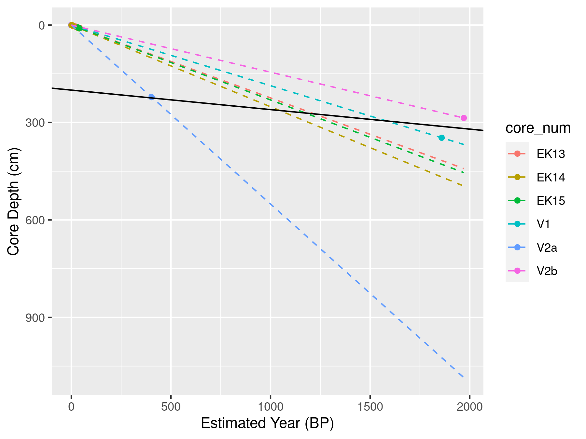
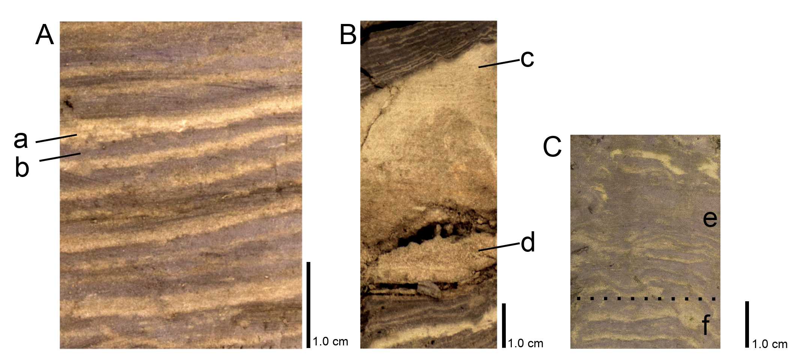

## Sediment Accumulation Chronology

Four vibra sediment cores, ranging from 2 – 4 m in length, were retrieved from the deepest portions of Cariboo Lake (Figure \@ref(fig:map-lake)). Cores V1 (2.9 m) and V2 (3.8 m) in the main Cariboo River basin were selected for detailed analysis as these two cores had organic material for AMS radiocarbon dating, and their sedimentary record was well preserved. The chronology of the two cores is provided by a small number of AMS radiocarbon dates and laminae counting. No evidence of volcanic tephra was found within either of the two cores. @Westgate1977 reports the most recent major volcanic ash event to reach central BC occurred 2100 yr BP, predating the basal age of the four sediment cores. This combined with the dark colour of the clastic core sediments prevented finding smaller volcanic ash events within the cores. Records of grain size, varve thickness, and organic content from these two cores demonstrate patterns in sediment delivery to Cariboo Lake over the past 2000 years.

*Chronology*

Organic material for dating in the clastic dominated cores was extremely limited. AMS radiocarbon dates obtained for cores V1 and V2 provide limited temporal control and evidence of sediment accumulation rates. A small twig from V1 at 347 cm yielded a date of 1899-1819 cal BP. Two separate samples were analyzed from V2, one comprised of a large twig at 222 cm yielding a date of 490-316 cal BP (V2a), and a combination of two separate organic pieces which were combined into one sample, a twig at 286 cm and a pine needle at 294 cm, providing a date of 2045-1895 cal BP (V2b). Figure \@ref(fig:amsRates) shows the dating calibration curves derived for the three AMS radiocarbon dates and accumulation rates from couplet thickness counting of Ekman surficial cores 13-15. The dates from samples V1 and V2b yield consistent accumulation rates of 1.87 +/- 0.04 mm/yr and 1.47 +/- 0.11 mm/yr respectively. AMS sample V2a yields an accumulation rate of 5.51 mm/yr inconsistent with the rates provided for V1 and V2b.

Ekman surficial cores 13-15, shown in Figure \@ref(fig:amsRates), are proximal to the V2 long core (see Figure \@ref(fig:map-lake)). The light-dark couplets in the short cores are identical to annual deposits noted in dozens of other lakes throughout BC  [e.g. @Hodder2007] so it is assumed that they closely approximate varves, in which case they exhibit accumulation rates of 2.24, 2.52, and 2.31 mm/yr respectively. Higher accumulation rates are expected for the Ekman samples as they are not subjected to the same level of compaction as is deeper sediment in the long cores. The consistency of the E13-E15 inferred accumulation rates when compared with two of the AMS dates from the V1 and V2b cores (Figure \@ref(fig:amsRates)) are additional compelling evidence of the varved nature of the sediment record. This consistency also suggests that the V2a AMS sample is suspect for temporal control. In viewing the V2a sample orientation and position along the outer core it is speculated that the sample may have been pulled down during the coring process due to the large twig size at about 4 cm. This probably results in the erroneously high accumulation rate for V2a.

Accumulation rates in areas proximal to river inputs in nearby Quesnel Lake were measured to be about 0.72 mm/a (see Figure 9 in Gilbert and Desloges, 2012). Sediment inputs are expected to be lower in Quesnel Lake compared to Cariboo Lake, with more arid and less glaciated portions of the Quesnel Lake watershed contributing to that lower rate. Accumulation rates of 1.47 to 1.87 mm are consistent for a smaller Cariboo Lake watershed with a higher fraction of glacier cover. Laminae couplet thickness in Ekmans and two of the three vibra core AMS dates do not support the V2a accumulation rate of 5.51 mm/yr and therefore it was not included in subsequent analysis. The AMS radiocarbon dates from samples V1 and V2b provide an important control when interpreting the inferred temporal pattern of sediment inputs to Cariboo Lake. The top section of cores V1 and V2 were disturbed during coring - 110 mm for V1 and 70 mm at V2. While the Ekman cores were too short to overlap with the undisturbed sections of the vibra cores, laminae thickness similarities shown in Figure \@ref(fig:amsRates), allow anchoring the top of core dates to 0/0 (depth/date).

```{r amsRates, echo=FALSE, fig.cap = "Cumulative accumulation rates for cores V1 and V2 using AMS dates V1, V2a and V2b and extrapolation of observed Ekman surficial core couplet thicknesses in E13, E14, and E15 all three of which are proximal to V2."}

```

Three distinct sediment facies were observed in both V1 and V2: discernible couplets, indiscernible couplets (disturbed facies) and graded turbidite events. The similarity in couplet structure and thickness between cores V1 and V2 strongly suggested these are varves. This interpretation is supported by the two valid AMS radiocarbon dated samples from cores V1 and V2 which corresponded reasonably well with the couplet count chronology at the same depth. A small difference between the two chronologies is present due to some isolated disturbed sections of core, core compaction, undercounting, and subjectivity in classifying the occasionally thicker (4 to 47 mm thick) graded to massive laminae/beds.

Laminae/beds with D~50~ grain size greater than 3 standard deviations from the mean were classified as event-based turbidite beds. Laminae with thickness greater than 6 standard deviations for V1 and 2 standard deviations for V2 from the mean were classified as event-based turbidite beds. Figure \@ref(fig:varve-turb) examples show the difference in regular laminae compared to an event-based turbidite bed. Turbidite beds observed in V1 and V2 were well defined and graded (see Figure \@ref(fig:varve-turb), d). These turbidite beds are similar in structure to those described in @sabatier2022 as originating from a flood, glacial lake outburst flood, or delta collapse event. Since the Cariboo River upstream of Cariboo Lake is filtered by headwater proglacial lakes, it is more likely the turbidite beds at the distal V1 and V2 site are from localized sidewall tributary floods. Collapse of the foreslope of an oversteppened Cariboo delta is also possible.

Where possible the thickness, grain size statistics, and percent organic matter (OM) were analyzed for each event layer. The turbidite bed grain size, OM, and thickness shown in Table \@ref(tab:turbTbl) illustrate the high sediment flux during these events compared to the regular, annually occurring couplets. The composition of sediment grains within the event-based layers were all characterized by a coarser single mode with less than 0.01% clay, over 98% silt and less than 1% sand. The grain size distribution for the regular couplet sediments is characterized by a bi-modal distribution with an average composition of 16% clay, 83% silt, and less than 1% sand. Figure \@ref(fig:turbScatter) shows that some event layers are coincident in time between V1 and V2. Since each of the event-based layers contain sediment deposited over a single, potentially localized event, they were removed from subsequent trend analyses of varve thickness, grain size, and percent organics. After removal, the long core sediment records are though to be most representative of watershed wide trends in river discharge influenced by temperature and precipitation rather than isolated events and inputs from nearby tributaries and hillslopes.

```{r varve-turb, echo=FALSE, fig.cap = "A. Example of regular laminae from V1 at a depth of 360 cm. B. an event-based turbidite bed from V2 at a depth of 230 cm. Features labeled within this figure include: ‘a’ high flow spring/summer freshet laminae, ‘b’ low flow winter laminae, ‘c’  top of the turbidite bed, and ‘d’ the bottom of the turbidite bed. C. shows massive beds (e) over more distict laminations (f)."}

```

```{r include=FALSE}
# construct df for turb tbl
non_event <- readRDS('data/long_cores/core_stats.rds') |> 
  # mutate(metric = case_when(
  #   metric == 'grain_size' ~ 'Grain Size',
  #   metric == 'varve_thickness' ~ 'Varve Thickness',
  #   metric == 'loi' ~ 'LOI',
  # ))
  dplyr::filter(stat %in% c('mean_no_flood')) |> 
  dplyr::group_by(core, metric) |> 
  dplyr::summarise(non_event_mean = mean(value)) 
  
  
tb <- readRDS('data/long_cores/turbidite_metrics.rds') |> 
  dplyr::select(value, stdep, core, metric) |> 
  dplyr::group_by(core, metric) |> 
  dplyr::summarise(event_mean = mean(value),
            event_sd = sd(value),
            event_n = dplyr::n()) |> 
  dplyr::mutate(metric = dplyr::case_when(
    metric == 'Grain Size' ~ 'grain_size',
    metric == 'Varve Thickness' ~ 'varve_thickness',
    metric == 'LOI' ~ 'loi',
  )) 
```

```{r turbTbl, echo=F}
dplyr::left_join(non_event, tb) |> 
  dplyr::arrange(metric)  |> 
  dplyr::mutate(metric = dplyr::case_when(
    metric == 'grain_size' ~ 'D~50~ (µm)',
    metric == 'varve_thickness' ~ 'Avg. Thickness (mm)',
    metric == 'loi' ~ 'OM (%)',
  )) |> 
  dplyr::rename(`Couplet (varve) mean` = non_event_mean, `Event mean` = event_mean, `Event sd` = event_sd, `Event n` = event_n) |> 
  flextable::flextable() |> 
  flextable::theme_booktabs() |> 
  flextable::set_caption("Sediment characteristics of regular laminae 'Couplet (varve)' compared to couplets classified as turbidite beds 'Events' for V1 and V2. The 'Couplet (varve)' is the mean sediment characteristic for all regular laminae couplets. The 'Event mean' is the mean sediment characteristic value for couplets classified as events, 'Event sd' is the standard deviation, and 'Event n' is the number of turbidite beds") |> 
  flextable::set_table_properties(width = 1, layout = "autofit")
```

```{r turbScatter, fig.width=8, fig.height=4, echo = F, fig.cap = "Timing and Standardized Departures of turbidite thickness, grain size, and OM for V1 and V2. Year (CE) is the estimated year using linear interpolation from the AMS radiocarbon dates."}
readRDS("figs/turbidite_plot.rds")
```

The varve-based chronology is based on the counting of discernible couplets with graded turbidite facies removed. The absence of laminae couplets in the disturbed-massive units makes interpreting the time elapsed over each of these units difficult (see Figure \@ref(fig:varve-turb C). To compensate for the depth intervals associated with the disturbed sections, a 30-year moving average of sediment accumulation rates from immediately above and below the disturbed sections were used to interpolate accumulation rates over each facies (see method described in Menounos et al., 2008). For core V1, laminae couplets were counted down to a core depth of 347 cm, where the AMS radiocarbon organic material was retrieved. This resulted in a V1 couplet-derived age estimated of 1450 BP compared to the AMS radiocarbon estimate of 1899 - 1819 cal BP. For core V2 a date of 1886 BP was estimated by couplet counting down to a core depth of 294 cm which matches more closely with the V2b AMS radiocarbon date of 2045-1895 cal BP. The better alignment between the couplet counting age and the AMS derived age in V2 can be attributed to the higher degree of core disturbance in V1 compared to V2. Disturbed sections that had indiscernible couplets may have resulted in the undercounting within core V1. Still, based on the relatively close agreement between the AMS radiocarbon dated organic material and couplet counting, laminae couplets in V1 and V2 are considered to be deposited annually. Close alignment was not expected due to the aforementioned errors present in the couplet counting methodology and the limited 14C dates available. 

The basal age for each core is estimated using both the varve chronology and the AMS radiocarbon accumulation rate. The basal age of V1 at a depth of 382 cm is approximately 1620 BP based on the varve chronology and 2046 cal BP based on the extrapolated 14C date. The basal age of V2 at a depth of 291 cm is about 1910 BP based on the varve chronology and 2007 cal BP by extrapolating the 14C. Accumulation rates estimated using the varve counting chronology and the AMS radiocarbon date chronology had a larger difference at V1 with 2.4 mm/yr and 1.87 +/- 0.04 mm/yr, respectively. Closer agreement was observed at V2 with 1.52 mm/yr estimated using the couplet counting method and 1.47 +/- 0.11 mm/yr from the AMS radiocarbon date. While V2 is likely the better predictor of changes in accumulation rates over the last 2000 years, we believe both cores are valid estimates of late Holocence sediment accumulation patterns in Cariboo Lake.  

*Sediment Accumulation Chronology and Statistics* 

For the laminae couplet timeseries, shown in Figure \@ref(fig:varves-a), only the discernible couplets are analyzed, event-based turbidites have been removed and disturbed facies are represented as gaps. The chronologies for this time series were derived using a linear interpolation from the AMS radiocarbon dates. The mean varve thickness for V1 is 2.4 mm and for V2 is 1.5 mm. Thicker varves are expected at V1 due to its closer proximity to the Cariboo River delta. This is also supported by the thicker varves observed in core E11 (proximal to V1) compared to E13 (proximal to V2) of 2.8 mm to 2.0 mm respectively. Figure \@ref(fig:varves-a) shows the time series of varve thickness measured from V1 and V2 and illustrates trends in suspended sediment delivery to Cariboo Lake. The measured couplet thicknesses in the two cores are plotted as standardized departures to facilitate comparison between the two cores. In each plot a 30-year moving average with a 1-year time step is plotted in black to emphasize decadal to centennial patterns in accumulation rate departures. The 30-year average varve thickness remains above average from 0 to 750 CE, for both V1 and V2, with a stronger signal observed for V1 which is closer to the main Cariboo River outlet. Below average varve thickness is observed at both V1 and V2 from 750-1600 CE. After 1600 CE, trends in varve thickness between the two cores depart, with V2 above average during the Little Ice Age and V1 remains below average. Sub-centennial trends are not reported due to the coarse temporal control for both V1 and V2. 

```{r varves-a, fig.width = 8, fig.height = 6, echo=FALSE, fig.cap = "Standardized departure from the mean varve thickness (VT) for cores V1 and V2. Events are removed from the record and disturbed facies are shown as blank gaps in the record. The gap width of disturbed facies was calculated using a linear interpolation from the AMS radiocarbon dates. The gray lines represent measured varve thickness at couplet (annual) resolution where available, the black line is a 30-year moving average. Gaps correspond to portions of the core that did not have discernible varves. The bottom axes, labeled Year (CE), was estimated using linear interpolation from the AMS radiocarbon dates. Laminae counting in V1 was not possible beyond the estimated date of 1890 CE and beyond 1970 CE in V2. The black X's on the bottom graph of V1 and V2 denote the AMS radiocarbon age (± dating error) and depth of the respective sample."}
readRDS('figs/V1_V2_varvethickness_vs_depth_and_C14_est_yr_ma.rds')
```

*Grain Size*

The mean D~50~ grain size at V1 is 7.6 +/- 0.01 µm compared to 6.3 +/- 0.01 µm at V2. The larger grain size and varve thickness at V1 compared to V2 is consistent with the spatial trends in sediment delivery observed from the Ekman cores. While based on a limited number of measurements compared to the varve thickness analysis, the temporal pattern in standardized departures of D~50~ grain size between the two cores shows a consistent pattern (Figure \@ref(fig:particle)). Both V1 and V2 have above average grain size between 0 to 700 CE and below average from 700 to 1500 CE. After 1500 CE, grain size follows an increasing trend with average to above average grain size. V1 shows a more dramatic increase in grain size compared to V2. While couplet thickness does not increase substantially over the LIA interval, gain size does. Overall, grain size fluctuations at a temporal resolution of about 100-years shows good correspondence between the two cores over the last 2000 years.

```{r particle, echo=FALSE, fig.width = 8, fig.height = 6, fig.cap = "Standardized departure from the mean D~50~ grain size for cores V1 and V2. The black points represent D~50~ grain size at 5 - 10 cm intervals and the gray line is the 3 sample (~125 year) moving average. The top axes, labeled Year (CE), was estimated using linear interpolation from the AMS radiocarbon dates. The black X's on the bottom graph of V1 and V2 denote the AMS radiocarbon age (± dating error) and depth of the respective sample."}
readRDS("figs/grain-size/V1_V2_grainsize_vs_depth_and_C14_est_yr.rds")
```

*Loss on Ignition*

The whole core average OM content at V1 and V2 is similar at 4.76% and 4.80%, respectively, suggesting that the flux of allochthonous organic material to the core locations is not dependent on distance from the main Cariboo River as it is easily transported through the lake due to low density. This is also supported by the Ekman OM spatial analysis, where a systematic down-lake relationship was not observed (Figure \@ref(fig:ekmanSeds), C). Figure \@ref(fig:loi) shows the percent organic matter (OM) for both V1 and V2. Higher levels of organic content are shown in V1 and V2 from 0-1000 CE and mostly below average from 1000-2000 CE. Specific periods of above average OM for V1 occur around CE 50-500, 650-1150, around 1300 and 1750-1850. OM in V2 matches above average values in the interval CE 250-550 and 650-950. During the last 100 years both cores show a persistent decline in OM which could be attributed to a relative increase in sediment delivery to Cariboo Lake suggested by the increase in D~50~ and varve thickness. As glaciers declined from peak LIA extents around 1750 CE, an increase in vegetation growth is expected which may also contribute to a decline in OM as organic content is locked up as needleleaf coniferous forest.

```{r loi, echo=FALSE, fig.width = 8, fig.height = 6, fig.cap = "Standardized departure from the mean percent organic matter (OM) for cores V1 and V2. The black points represent percent OM at 2.5 - 5 cm intervals and the gray line is the 3 sample (~75 year) moving average. The top axes, labelelled Year (CE), was estimated using linear interpolation from the AMS radiocarbon dates. The black X's on the bottom graph of V1 and V2 denote the AMS radiocarbon age (± dating error) and depth of the respective sample."}
readRDS("figs/V1_V2_LOI_vs_depth_and_C14_est_yr.rds")
```
