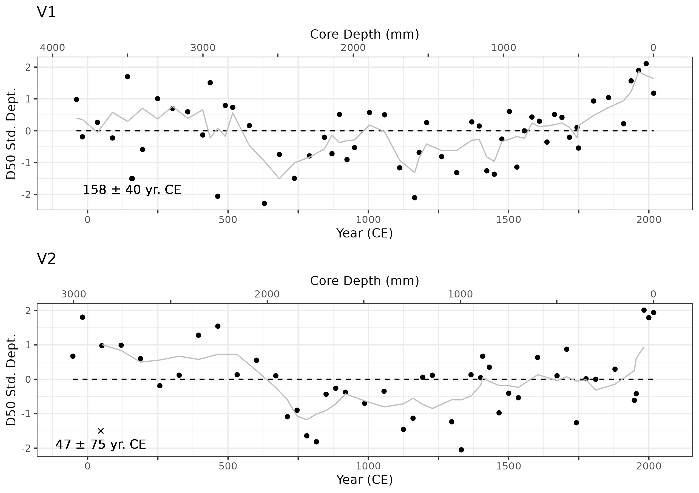

```{r setup, include=FALSE}
library(dplyr)
knitr::opts_chunk$set(echo = TRUE)
knitr::opts_chunk$set(out.width = "100%", Figurealign = 'center')
```

Four glaciolacustrine sediment cores, which range from 2 – 4 m in length, were retrieved from the deepest basins of Cariboo Lake (Figure \@ref(fig:map)). Cores V1 and V2 were selected for detailed analysis as these two cores had sufficient organic material for AMS radiocarbon dating, and their sedimentary record was well preserved. Records of grain size, varve thickness, and organic content from these two cores demonstrate patterns in sediment delivery to Cariboo Lake over the past 1500 years. 

*Chronology*

AMS radiocarbon dates obtained for cores V1 and V2 provide temporal control and evidence of sediment accumulation rates. A small twig from V1 at 347 cm yielded a date of 1899-1819 cal BP. Two separate samples were analyzed from V2, one comprised of a large twig at 222 cm yielding a date of 490-316 cal BP (V2a), and a combination of two separate organic pieces which were combined into one sample, a twig at 286 cm and a pine needle at 294 cm and provided a date of 2045-1895 cal BP (V2b). Figure \@ref(fig:amsRates), shows the dating calibration curves derived for the three AMS radiocarbon dates. The date provided for sample V2a, yields a sedimentation rate of 5.51 mm/yr, which is much higher, relative to the rates of 1.87 +/- 0.04 mm/yr and 1.47 +/- 0.11 mm/yr provided for V1 and V2b respectively. Additional sedimentation rates derived from the Ekman surficial cores 13-15 are shown in Figure \@ref(fig:ekRates), which are proximal to the V2 core (see Figure \@ref(fig:map)), and exhibit sedimentation rates of 2.24, 2.52, and 2.31 mm/yr respectively. Higher sedimentation rates are expected for the Ekman samples are they are not subjected to the same level of compaction as the long cores. Still, the consistency of the EK13-15 sedimentation rates with the V1 and V2b AMS sedimentation rate, shown in Figure \@ref(fig:amsEkRates) suggests that the V2a sample may have been pulled down during the coring process due the large twig size of 4 cm resulting in a erroneously high sedimentation rate for V2a. Since no evidence was found to support the V2a sedimentation rate of 5.51 mm/yr, it was not included in subsequent analysis. The AMS radiocarbon dates from samples V1 and V2b provide an important temporal control when interpreting the following sediment analyses. The top section of cores V1 and V2 were disturbed, 110 mm for V1 and 70 mm at V2. Since a preserved sediment water interface was not available, an additional date of 0 cal BP at a core depth of 0 cm, is not provided.

```{r map, echo=FALSE, fig.cap = "Location of long cores and Ekman surficial cores."}
knitr::include_graphics("figs/map.png")
```

```{r amsRates, echo=FALSE, fig.cap = "Sediment accumulation rates derived from the three C14 dates for Cores V1 (Red), and V2 (Green and Blue. The black line is the line of best fit through all three ams radio carbon dates."}
knitr::include_graphics("figs/ams_sed_rates.png")
```

```{r ekRates, echo=FALSE, fig.cap = "Sedimentation rates for Ekman surficial cores proximal to core V2."}
knitr::include_graphics("figs/ekman_sed_rate_near_V2.png")
```

```{r amsEkRates, echo=FALSE, fig.cap = "Cumulative sedimentation rates for cores V1 and V2 and Ekman surficial cores EK13, 14, and 15 proximal to V2."}
knitr::include_graphics("figs/sed_rates_V1_V2_ekmans.png")
```

The sediment laminae chronology from cores V1 and V2 are interpreted as annual couplets or varves. This interpretation is supported by the AMS radiocarbon dated samples from cores V1 and V2 which corresponded reasonably well with the age of the varve at the same depth. However, some error is present in the varve chronology due to the presence of disturbed sections of core, core compaction, undercounting, and subjectivity in classifying flood events. The degree of surface disturbance was larger than expected in both V1 and V2, due to the vibra coring process. This led to sections of the cores without visible laminae couples, primarily near the tops of the cores. A total of 127 mm of V1 was disturbed and 75 mm of V2 was disturbed. In the absence of laminae couplets, the time elapsed over disturbed sections, was interpolated using a 30-year moving average sediment rate following methods described in Menounos et al., 2008. 

laminae couplets with thicknesses greater than 3 standard deviations from the mean were classified as event-based turbidite beds. Table \@ref(tab:turbTbl), shows the eight turbidites observed in V1 and nine turbidites observed in V2, and their corresponding laminae thickness and estimated year by AMS radiocarbon date. Figure \@ref(fig:turbScatter), shows the timing of the turbidite beds are not correlated between most of the turbidite events at V1 and V2. Therefore, it is likely the turbidite beds are formed by isolated events, proximal to the core location such as adjacent hillslope failures, turbidite side-wall slumps and/or very local debris flows. Since the turbidite beds were inferred to be localized events they were removed from the varve counting chronology. 

```{r turbTbl, echo=F}
readRDS('figs/turbidite_tbl.rds') %>% 
  knitr::kable(digits = 2,
               booktabs = T,
               format = 'latex',
               caption = 'Timing and thickness of turbidite laminae (Lam.) for V1 and V2. Est. Year (CE) is the estimated year using linear interpolation from the AMS radiocarbon dates.')
```

```{r turbScatter, echo = F, fig.cap = "Timing and thickness of turbidite laminae in V1 and V2. Year (CE) is the estimated year using linear interpolation from the AMS radiocarbon dates."}

```

For core V1, laminae couplets were counted down to the core depth of 347 cm, where the AMS radiocarbon organic material was retrieved, which resulted in a varve estimated date of 1451 BP, compared to the AMS radiocarbon estimate of 1899 - 1819 cal BP. For core V2 a date of 1886 BP was estimated by laminae couplet counting down to a core depth of 294 cm which matches up closely with the second AMS radiocarbon date of 2045-1895 cal BP. The better alignment between the varve chronology is likely attributed to the higher degree of core disturbance at V1 compared to V2 which may have resulted in undercounting of some laminae couplets. Still, based on the relatively close agreement between the AMS radiocarbon dated organic material and the varve chronology, laminae couplets at V1 and V2 are considered to be deposited annually. Close alignment was not expected due to the aforementioned error present in the varve counting methodology and the coarse resolution of the AMS radiocarbon date. 

The basal age for each core for was estimated using both the varve chronology and the AMS radiocarbon sedimentation rate. The basal age of V1 at a depth of 382 cm is 1622 BP based on the varve chronology and 2046 cal BP when extrapolating the AMS radiocarbon date. The basal age of V2 at a depth of 291 cm is 1913 BP based on the varve chronology and 2007 cal BP by extrapolating. The basal dates for these cores are only an approximation but given the relatively close agreement between the varve chronology and radiocarbon dates they are a reasonable estimate. 

*Sediment Yield Statistics* 

Higher sedimentation rates were observed proximal to the Cariboo River Delta in V1 compared to the more distal core V2, as was observed in the Ekman surficial cores. Sedimentation rates estimated using varve chronology and AMS radiocarbon dates had a larger difference at V1 with 2.4 mm/yr and 1.87 +/- 0.04 mm/yr respectively. Closer agreement was observed at V2 with 1.52 mm/yr estimated by the varve chronology and 1.47 +/- 0.11 mm/yr from the AMS radiocarbon date. Some error is observed between the sedimentation rates estimated by the varve chronology and the AMS radiocarbon dates, particularly for V1, likely due to some of the aforementioned sources of error in the varve chronology and AMS radiocarbon methods. Still, the relatively close agreement between the two sedimentation rates gives confidence in further interpretations of the varve chronology at multi-decade to century time scales. 

Figure \@ref(fig:varves) shows varve thickness measured from V1 and V2, which illustrates trends in suspended sediment delivery to Cariboo Lake at sub-decadal to centennial time scales. The chronology for Figure \@ref(fig:varves) is calculated using linear interpolation from the single AMS radiocarbon date at V1 and V2. At V1, the 30-year average varve thickness remains above average from CE 0-600, 850-950, 1000-1100, 1150-1200 and below average between CE 800-850, 950-1000, 1100-1150, and 1200-1850. At V2, varve thickness is above average between CE 0-250, 350-450, 550-600, 1500-1600, 1700-1800, and 1900-1950 and below average between CE 250-350, 450-550, 1950-1500, 1450-1500, 1800-1900. Above average varve thickness is consistent between V1 and V2 between 0-500 CE, with a stronger signal observed for V1 which is closer to the main Cariboo River outlet. Below average varve thickness is observed at both V1 and V2 between 1000-1500 CE, with a stronger signal at V2. After this, trends in varve thickness between the two cores are not consistent, but generally remain below average for V1 and above average for V2. Sub-centennial trends are not reported due to the coarse temporal control for both V1 and V2. 

```{r varves, echo=FALSE, fig.cap = "Standardized departure from the mean varve thickness for cores V1 and V2. The gray lines represent measured varve thickness, the black line is a 30-year moving average, gaps correspond to portions of the core that did not have discernible varves. The top axes, labelelled Year (CE), was estimated using linear interpolation from the AMS radiocarbon dates. The black points on the bottom graph of V1 and V2 denote the AMS radiocarbon age (± dating error) and depth of the respective sample."}

```

*Grain Size*

Figure \@ref(fig:particle) shows that grain size for both V1 and V2 is above average between 0-500 CE and below average from 700-1500 CE. After 1500 CE grain size follows an increasing trend at V1 and at V2 grain size remains around average until 1950 CE where there is an increase. Overall, grain size fluctuations at a 100-year resolution show good correspondence between cores V1 and V2 over the past 2000 years. Event-based layers identified in the varve thickness chronology were removed from the grain size analysis presented here. The composition of sediment grains within the event-based layers were all characterised by a single mode with less than 0.01% clay, over 98% silt and less than 1% sand. The average D50 particle size of non-event based sediment is 7.6 µm and 6.4 µm for V1 and V2 respectively. The particle size distribution for non-event based sediment is characterized by a bi-modal distribution with an average composition of 13% clay, 86% silt, and 0.8% sand sized particles at V1 and 81% silt, 18% clay, and 0.5% sand sized at V2. 

```{r particle, echo=FALSE, fig.cap = "Standardized departure from the mean D50 grain size for cores V1 and V2. The black points represent D50 particle size at 5 - 10 cm intervals and the gray line is the 3 sample (~125 year) moving average. The top axes, labelelled Year (CE), are calculated as per Figure X. The black X's on the bottom graph of V1 and V2 denote the AMS radiocarbon age (± dating error) and depth of the respective sample."}

```

*Loss on Ignition*

Figure \@ref(fig:loi) shows the percent mass lost on ignition (LOI) for both V1 and V2. Higher levels of organic content are shown in V1 and V2 from from 0-1000 CE and mostly below average from 1000-2000 CE. Specific periods of above average LOI for V1 occur around CE 0-500, 650-1100, 1150, 1300, 1750-1850 and below average between 50 BCE - 50 CE, CE 550-650, 1150-1300, 1350-1750, 1850-2000. LOI is above between at V2 around CE 0-100, 250-500, 650-900, 1800-1950, and below average between 1000-1050, 1300-1600, 1950-2000. The average LOI at V1 and V2 is similar at 4.76% and 4.80% respectively suggesting that the flux of allochthonous organic material to the core locations is not dependent on distance from the main Cariboo River as it is easily transported through the lake due to the low density. 

```{r loi, echo=FALSE, fig.cap = "Standardized departure from the mean percent LOI for cores V1 and V2. The black points represent percent LOI at 2.5 - 5 cm intervals and the gray line is the 3 sample (~75 year) moving average. The top axes, labelelled Year (CE), are calculated as per Figure X. The black X's on the bottom graph of V1 and V2 denote the AMS radiocarbon age (± dating error) and depth of the respective sample."}
knitr::include_graphics("figs/V1_V2_LOI_vs_depth_and_C14_est_yr.png")
```
